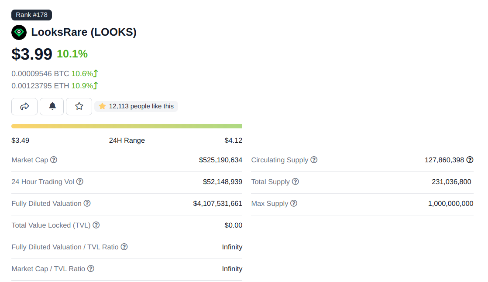
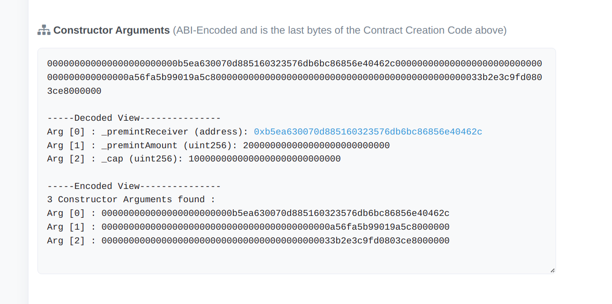

不知道你是否和我一样，总是担心关注的 token 增发，但又对 CoinGecko 或者 Etherscan 上的数字心怀疑虑。以太坊上每个 token 都是独立的合约，那就深入合约来探个究竟吧。Code is Law！ 

让我们以最近发行的 LooksRare 项目为例。

|  |
|:--:|
| 2022-01-16 CoinGecko 截图 |
|  |
| 2022-01-16 Etherscan 截图 |

可以从 CoinGecko 看到有 `Total Supply` 和 `Max Supply` 两个概念。从 Etherscan 的 token 页面又会看到 `Max Total Supply`。 这三个数字并不一致。我并不清楚 CoinGecko 和 Etherscan 的具体机制，所以直接看看这个 token 的合约吧。 

```js
    // File 1 of 7 : LooksRareToken.sol
    constructor(
        address _premintReceiver,
        uint256 _premintAmount,
        uint256 _cap
    ) ERC20("LooksRare Token", "LOOKS") {
        require(_cap > _premintAmount, "LOOKS: Premint amount is greater than cap");
        // Transfer the sum of the premint to address
        _mint(_premintReceiver, _premintAmount);
        _SUPPLY_CAP = _cap;
    }
```

以太坊智能合约部署后，首先运行的就是 `constructor` 函数。可以看出 LOOKS 的 `constructor` 有三个参数。 

|  |
|:--:|
| [合约地址页面中 Contract Tab 最下面的部分](https://etherscan.io/address/0xf4d2888d29d722226fafa5d9b24f9164c092421e#code) |

在 Etherscan 上找出[该合约的信息](https://etherscan.io/address/0xf4d2888d29d722226fafa5d9b24f9164c092421e)，找出 `Constructor Arguments`。 看到 `_cap` 传入的值为 `1000000000000000000000000000`，这个值除 10^18 就是 1000 mil，就能和 CoinGecko 中的`Max Supply`对应上了。

```js
    // File 3 of 7 : ERC20.sol
    function decimals() public view virtual override returns (uint8) {
        return 18;
    }
```

为什么要除以 10^18 呢？ 这是因为普通用户看到的 1 个 token，其实是 `10^decimals` 个最小单位。这样，合约程序只处理整数，而在界面上可以显示小数（例如 0.1 或 0.01）个的 token。

那么 CoinGecko 的 `Total Supply` 又是什么呢？ 这个数字和 Etherscan 的 `Max Total Supply` 是接近的，都是 200+ mil。有理由猜测这是一个动态的数字，两个网站都想监测这个动态数字，但不太同步。有了这个猜想后，再回头看看 LOOKS 的合约。

```js
    // File 3 of 7 : ERC20.sol
    function totalSupply() public view virtual override returns (uint256) {
        return _totalSupply;
    }
```

符合 `ERC20` 标准的 token 都有只读函数 `totalSupply()`。这是一个 `view` 函数，可以读取链上 state，但不会写入。随着链上不断出现新 block，`view` 函数的返回值也可能变化。在 Etherscan 上可以直接读取，可以发现确实是 200+ mil。

之前注意到的 `_cap` 只是初始化 `_SUPPLY_CAP` 变量，并没有改变 `_totalSupply`。


ERC20： https://eips.ethereum.org/EIPS/eip-20
`view`函数： https://medium.com/taipei-ethereum-meetup/solidity-weekly-11-70c5208a3bf1
