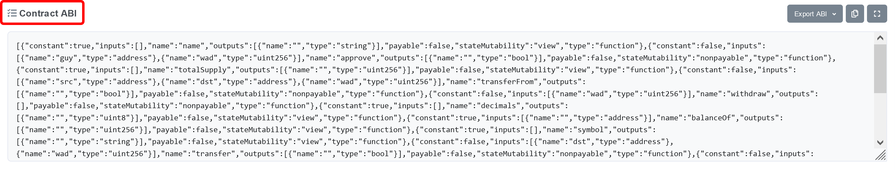
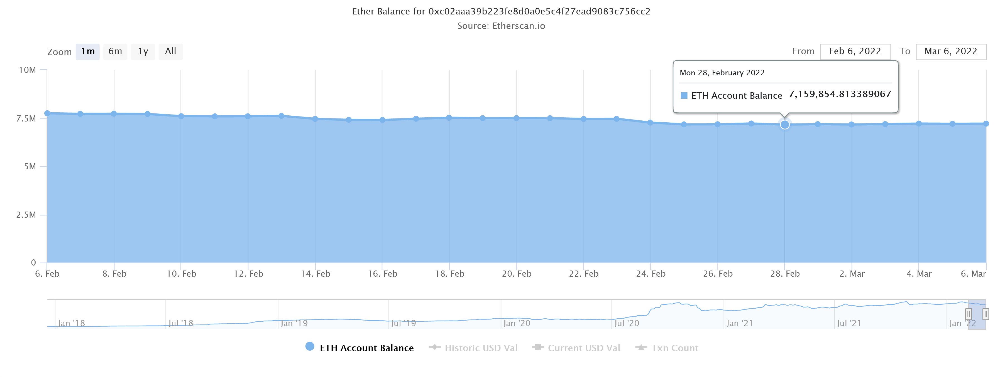

在上一篇[文章](./hardhat-forking-1.md)我們已經學會了怎麼使用 Hardhat mainnet forking，但是讀者可能尚有疑惑不知道這樣的功能可以做什麼？本篇文章將延續相同主題，並給出幾個例子，向讀者展示 mainnet forking 能夠為開發過程帶來的方便性。


範例一：與 `WETH9` 合約互動
---
此附錄將透過執行一段簡短的 JavaScript 腳本，向讀者展示要怎麼在已完成 mainnet forking 的 Hardhat Network 之內，與知名的 Wrapped Ether（`WETH9`）合約互動。關於什麼是 Wrapped Ether 的疑問，請參考文末延伸閱讀或請讀者自行查詢其他網路資料。

1. 在 `hardhat_fork` 資料夾底下創立新的資料夾 `scripts`
2. 前往 Etherscan.io 或任何你信任的 Ethereum blockchain explorer 尋找 WETH 合約
   - https://etherscan.io/address/0xc02aaa39b223fe8d0a0e5c4f27ead9083c756cc2#code
3. 將合約 ABI 儲存成 `contract-abi.json` 檔案，並放置於 `hardhat_fork/scripts` 資料夾底下
   - 若是使用 Etherscan，則需滾動至網頁最下方，如圖所示



4. 前往這個 Gist 下載 `interact.js` 腳本，並且把它儲存在 `hardhat_fork/scripts` 資料夾底下
   - https://gist.github.com/a2468834/6101244f5000e467ec8904ac5f0ec41d
   - 或可至 GitHub 上面，包含本文之 repo 下載
5. 截至目前為止，`hardhat_fork` 資料夾應該要長得像這樣子[^8]
```Shell
📂 hardhat_fork
 │
 ├── 📂 scripts
 │    │
 │    ├── 📄 contract-abi.json
 │    │
 │    └── 📄 interact.js
 │
 ├── 📄 .env
 │
 └── 📄 hardhat.config.js
```
6. 執行指令
```Shell
$ yarn hardhat --network "hardhat" run scripts/interact.js
yarn run v1.22.17

Check contract status
--------------------------------------------------------------------------------
        ETH-Balance                     WETH-Balance
WETH9   7160157.033871775794435313      7160157.033871775794435313

[Step 0] Before we started
--------------------------------------------------------------------------------
Account Address             ETH-Balance     WETH-Balance
#0      0xf39f......2266    10000.000       0.000
#1      0x2feb......a6f3    4.294           13813.827

[Step 1] Account#1 deposits 3 ETH in contract
--------------------------------------------------------------------------------
Account Address             ETH-Balance     WETH-Balance
#0      0xf39f......2266    10000.000       0.000
#1      0x2feb......a6f3    1.291           13816.827

[Step 2] Account#1 sends 13 WETH to Account#0
--------------------------------------------------------------------------------
Account Address             ETH-Balance     WETH-Balance
#0      0xf39f......2266    10000.000       13.000
#1      0x2feb......a6f3    1.286           13803.827

[Step 3] Account#0 withdraws 13 WETH from contract
--------------------------------------------------------------------------------
Account Address             ETH-Balance     WETH-Balance
#0      0xf39f......2266    10012.997       0.000
#1      0x2feb......a6f3    1.286           13803.827

================================================================================
{
  hash: '0x1dfa3eee62caaf1aa06d60b9fd57d67d17fe23c9f9452c1e3284056e6fad6e48',
  type: 2,
  accessList: [],
  blockHash: '0x3750ecaf4f7ccf733ceed460a0aeb54b3dd2373dc199ba5b420e062c5d39f165',
  blockNumber: 14297760,
...
```

由於 Gist 上面的程式稍微較長，因此作者並不打算逐行解釋，以下將挑幾個讀者注意的小地方做重點解析。

1. 如果沒有 mainnet forking 可以用，則我們必需先將 `WETH9` 合約部屬在 local Hardhat Network （且只能得到與主網不一樣的合約地址），才能與之互動；可想而知就是增加複雜度，卻降低仿真度的土法煉鋼。
2. 程式碼 Line 34：`hre.ethers.getSigners()` 會回傳一個長度為 20 的 ethers.js Signer 陣列，就是前文所述的那 20 個各有 10000 ETH 的帳號
3. 在最開頭，程式向 `WETH9` 合約詢問其 weth 總發行量，並與此合約地址的 balance 做比較
   - 兩者數值相符且與 Etherscan 上的餘額吻合
   - Etherscan Analytics 分頁謹顯示當日日末餘額，因此需查詢前一日餘額為準

4. 在 step 1，我們以隨機挑選的地址的名義，向 `WETH9` 合約存款 3 eth；之所以此行為不是 invalid tx，歸功於 Line 41 開啟 `hardhat_impersonateAccount` 模式[^9]，它讓我們能夠在 Hardhat Network 內以未知密鑰地址的名義發送 tx。
5. 最後會印出稍早完成的所有 tx 的細節
   - 讀者可以透過 `blockNumber` 查覺到這些 tx 與當初指定 mainnet forking 區塊高度之間的關聯性
6. 由於傳送 tx 需要耗費 tx fee，所以我們可以發現最終 `Account #0` 和 `Account #1` 的 eth 餘額比一開始少


另外，作者同樣透過 mainnet forking 技巧，撰寫另一份 JavaScript 腳本，只需將第四步驟改為下載此腳本，即可執行另一種常見的任務。
- https://gist.github.com/a2468834/71c59d580c1da21337350cdfc47e515b
- 或可至 GitHub 上面，包含本文之 repo 下載
- 此腳本透過循序變換 mainnet forking 的分叉高度，達成「查詢某個區間內，`WETH9` 合約的 `totalSupply()` 數值變化」
- 讀者亦可使用 Dune Analysis 等平台達成此目的，然而靈活度度與支付規費不如自行寫腳本來的好


[^8]: 有省略一些與本文無關的檔案與資料夾
[^9]: https://hardhat.org/hardhat-network/reference/#hardhat-impersonateaccount


範例二：抓取 `public` 變數的歷史數據
---

另外，作者同樣透過 mainnet forking 技巧，撰寫另一份 JavaScript 腳本，只需將第四步驟改為下載此腳本，即可執行另一種常見的任務。
- https://gist.github.com/a2468834/71c59d580c1da21337350cdfc47e515b
- 或可至 GitHub 上面，包含本文之 repo 下載
- 此腳本透過循序變換 mainnet forking 的分叉高度，達成「查詢某個區間內，`WETH9` 合約的 `totalSupply()` 數值變化」
- 讀者亦可使用 Dune Analysis 等平台達成此目的，然而靈活度度與支付規費不如自行寫腳本來的好


Related resources
---
- Yarn
  - https://classic.yarnpkg.com/en/
- Hardhat
  - GitHub：https://github.com/NomicFoundation/hardhat
  - Mainnet forking：https://hardhat.org/hardhat-network/guides/mainnet-forking.html
  - Configuration：https://hardhat.org/config/
  - Hardhat Network Reference：https://hardhat.org/hardhat-network/reference/
  - Creating a task：https://hardhat.org/guides/create-task.html
  - Hardhat Runtime Environment (HRE)：https://hardhat.org/advanced/hardhat-runtime-environment.html
- Alchemy
  - https://www.alchemy.com/
- Ethereum on ARM
  - https://ethereum-on-arm-documentation.readthedocs.io/en/latest/quick-guide/about-quick-start.html
- Wrapped Ether
  - https://weth.io/index.html

Further reading
---
- Infura
  - https://infura.io/
- QuickNode
  - https://www.quicknode.com/
- Truffle
  - Simulate Live Networks with Forked Sandboxes：https://trufflesuite.com/blog/sandbox-forking-with-truffle-teams/index.html