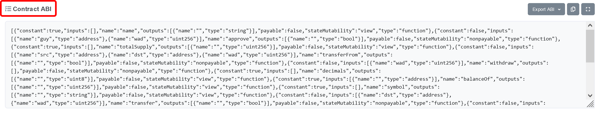

在 Ethereum 進行 Dapp 開發少不了撰寫智能合約（smart contract）；除了使用 Geth（Go Ethereum）、OpenEthereum 等工具自行建立 local testnet，並且將合約部屬在上面之外，還可以將合約部屬到各大公開測試網（testnet）[^1]。然而，這些方法雖然都使用與主網（mainnet）幾乎相同的[^2]程式碼當作 L1 底層，但是與直接部屬在 mainnet 最大的差異就是：你幾乎無法讓 Dapp 與其他知名合約、DEX 作互動。

DeFi 之所以在近年受到全球矚目，其中一個原因莫過於其高度的互操作性（interoperability）；各個合約之間可以透過程式呼叫，輕鬆地與彼此互動，達成傳統金融所無法企及的巨大靈活能力。

然而，如果你正在開發的 Dapp/DeFi 專案，無法在極度擬真的環境當中進行最完整的測試就貿然上線，則此服務將暴露於巨大風險之下。

部屬合約於 (local) testnet 當中，為求最精緻的模擬環境，你將會耗費極大心力逐一複製所有第三方合約、DEX 的程式碼，並重新佈署於模擬環境當中，這完全不是一個可行的方法。

這篇教學文章將展示內建於知名開發工具 Hardhat 的主網分叉功能（mainnet forking），開發者可以任意指定欲分叉的區塊鏈高度，並與 Hardhat 內建的自定義 testnet（Hardhat Network）結合，享受最高仿真度、最簡便的開發環境。

> You can start an instance of Hardhat Network that forks mainnet. This means that it will simulate having the same state as mainnet, but it will work as a local development network. [^3]

[^1]: 例如：Rinkeby、Goerli、Kintsugi 等
[^2]: 可能因不同 testnet 共識機制，而與主網略有差異，但是一般來說很罕見出現 Dapp 能夠運行於 testnet 卻無法運行於 mainnet，尤其所有網路的 EVM 實作細節均相同
[^3]: https://hardhat.org/hardhat-network/guides/mainnet-forking.html#mainnet-forking


背景知識與環境設定
---
本文**不會**提供 Hardhat 與其他相關套件的安裝指引，亦**不會**細探任何與 Dapp 和 smart contract 有關的知識與開發技巧；請讀者應了解如何撰寫、部屬、呼叫合約[^4]，並且準備好下述之軟硬體開發環境。另外，Truffle（Ganache）亦有提供 mainnet forking 功能，在抽象概念方面雷同，然本文僅介紹 Hardhat 環境需如何設定。

- Software
  - Windows
    - OS：Windows 10 Pro 21H1 (w/o WSL)
    - nodejs v14.17.4
    - yarn 1.22.17
  - Linux
    - OS：Ubuntu 20.04.4 LTS (GNU/Linux 5.4.0-1053-raspi aarch64)
    - 其他同 Windows 軟體配置
- Hardware
  - 基本上無限制，下列為經過測試可行的組合
  - Windows：Intel Core i7-10510U (16GB) with 4G LTE cellular hotspot
  - Linux：Raspberry Pi 4B (4GB) with 1Gbps network

[^4]: 若您已知道如何利用 Hardhat 或 Truffle 或任何開發框架，部屬最基本的 ERC-20 合約，則本文深度恰巧適合您。


重要必備條件
---
由於 mainnet forking 的實作細節是與一個歸檔節點（archived node）的歷史資料作互動，藉此方能實現於開發者指定的任意區塊高度進行 mainnet forking；因此，**你必需準備好 archived node** 並使得 Hardhat 能夠連接上它。最直白地方式即透過 Geth、OpenEthereum 等工具自架節點[^5]，或是使用市面上知名的數家 SaaS 節點供應商之服務[^6]。本文為求過程簡潔、輕鬆好學習，以下將搭配 Alchemy 提供的服務。

附註：以下文章所附的指令或程式碼，若無特別提到 Windows 或 Linux，則代表兩者皆可使用相同內容成功執行

[^5]: 透過樹梅派 4B 可以搭建歸檔節點，不以挖礦為目的來搭建歸檔節點非難事，只需要準備大容量的 SATA3 SSD 即可，詳細請參考文末的延伸閱讀 Ethereum on ARM
[^6]: Infura、Alchemy、QuickNode 均有提供存取歸檔節點的服務，其中 Alchemy 在作者撰文時為免費服務。


Step 1：建置環境
---
目標：成功啟動 Hardhat Network

1. 新增一個空白資料夾「`hardhat_fork`」
```Shell
$ mkdir hardhat_fork
$ cd hardhat_fork
```
2. 安裝必備的 JavaScript 套件
   - 為求所有讀者都能在第一次操作時成功完成，本文將所有套件已指定版本號安裝
   - 作者建議讀者學會之後，以使用最新 stable version 為佳
```Shell
$ yarn init # 沒有想更動的部分，就按 Enter 鍵帶過即可
...
$ yarn add dotenv@16.0.0
...
$ yarn add hardhat@2.8.4
...
$ yarn add @nomiclabs/hardhat-waffle@2.0.2
...
$ yarn add @nomiclabs/hardhat-web3@2.0.0
...
$ yarn add @nomiclabs/hardhat-ethers@2.0.5
...
$ yarn add web3@1.7.0
...
$ yarn add ethers@5.5.4
...
```
3. 啟動 Hardhat Network 初始化設定
```Shell
$ yarn hardhat
yarn run v1.22.15
888    888                      888 888               888
888    888                      888 888               888
888    888                      888 888               888
8888888888  8888b.  888d888 .d88888 88888b.   8888b.  888888
888    888     "88b 888P"  d88" 888 888 "88b     "88b 888
888    888 .d888888 888    888  888 888  888 .d888888 888
888    888 888  888 888    Y88b 888 888  888 888  888 Y88b.
888    888 "Y888888 888     "Y88888 888  888 "Y888888  "Y888

Welcome to Hardhat v2.8.4

? What do you want to do? …
  Create a basic sample project
  Create an advanced sample project
  Create an advanced sample project that uses TypeScript
▸ Create an empty hardhat.config.js # 請選擇這個選項，並按 Enter
  Quit

$ ls
hardhat.config.js  node_modules  package.json  yarn.lock
```
4. 你可以發現 `hardhat_fork` 資料夾底下多了一個名為 `hardhat.config.js` 的檔案；它就是用來調整 Hardhat Network 和其他 hardhat 套件運作模式的重要參數檔。


Step 2：調整 `hardhat.config.js`
---
目標：設定進行 mainnet forking 所需的相關參數

1. 在 `hardhat_fork` 資料夾，新增一個空白檔案叫做 `.env`，並以文字編輯器將以下內容插入其中
   - 記得先前往 Alchemy 註冊帳號，並創立一個空白 app 專案，然後方能取得 key
```
Mainnet = "https://eth-mainnet.alchemyapi.io/v2/<your_Alchemy_key>"
```
2. 使用任何文字編輯器，對 `hardhat.config.js` 進行編輯，將檔案改成以下樣子（可以直接複製、貼上，取代全部檔案內容）
```js
require("@nomiclabs/hardhat-waffle");
require("@nomiclabs/hardhat-web3");
require("@nomiclabs/hardhat-ethers");
require('dotenv').config();

task("height", "Print the current block height")
  .setAction(async (taskArgs) => {
    const block_height = await web3.eth.getBlockNumber();
    console.log(`The current block height is ${block_height}`);
  });

module.exports = {
  networks: {
    hardhat: {
      forking: {
        url: process.env.Mainnet,
        blockNumber: 14297759
      }
    }
  }
};
// 高度 14297759 發生在 2022-03-01 00:00:18 (UTC+0)，選擇此數字方便後續解說
```
3. 為什麼要這樣設定呢？
   - `task()` 的程式片段目的是創造能印出目前區塊高度的指令（以 Hardhat Network 分叉出來的主網來看），關於 task 的編寫方法詳見文末的延伸閱讀
   - `network` 項目底下，我們設定 `hardhat` 網路的相關參數，包含 archived node 的存取網址與分叉高度
   - 由於 `network` 項目底下可以同時設定多個不同的網路，以下為簡易範例，詳細辦法請參見文末延伸閱讀
```js
module.exports = {
  solidity: {...},
  networks: {
    arbitrum: {
      url: process.env.Arbitrum, 
      accounts: [process.env.PriKey0, process.env.PriKey1]
    },
    hardhat: {...}
  }
};
```


Step 3：使用自定義的 Hardhat task `height`
---
目標：透過自定義的 `height` task 來確認 mainnet forking 可正常運作

1. 列出所有可用的 Hardhat task
   - `--network "hardhat"` 代表命令 Hardhat 使用 Hardhat Network
   - 如果讀者在 `hardhat.config.js` 裡面設置其他網路，則可透過此參數隨時切換網路
   - 我們可以發現到「`AVAILABLE TASKS`」出現了一行 `height Print the current block height` 文字，與稍早我們在 `hardhat.config.js` 撰寫的內容一致
```Shell
$ yarn hardhat --network "hardhat" help
yarn run v1.22.17
Hardhat version 2.8.4

Usage: hardhat [GLOBAL OPTIONS] <TASK> [TASK OPTIONS]

GLOBAL OPTIONS:
  --config              A Hardhat config file.
  --emoji               Use emoji in messages.
  --help                Shows this message, or a task's help if its name is provided
  --max-memory          The maximum amount of memory that Hardhat can use.
  --network             The network to connect to.
  --show-stack-traces   Show stack traces.
  --tsconfig            A TypeScript config file.
  --verbose             Enables Hardhat verbose logging
  --version             Shows hardhat's version.

AVAILABLE TASKS:
  check         Check whatever you need
  clean         Clears the cache and deletes all artifacts
  compile       Compiles the entire project, building all artifacts
  console       Opens a hardhat console
  flatten       Flattens and prints contracts and their dependencies
  height        Print the current block height
  help          Prints this message
  node          Starts a JSON-RPC server on top of Hardhat Network
  run           Runs a user-defined script after compiling the project
  test          Runs mocha tests
```
2. 運行 `height` 指令
   - 由於目前 Ethereum 的最新區塊高度必定不只 14297759，因此可見我們已成功創造一個全新的 mainnet forking 環境
```Shell
$ yarn hardhat --network "hardhat" height
yarn run v1.22.17
The current block height is 14297759
```
3. 利用 `node` 指令，開始運作 Hardhat Network 節點
   - 前文已提過 Hardhat Network 預設提供 20 個各具 10000 ETH 的帳號供開發者自由使用
   - 搭配我們現已學會的 mainnet forking 技巧，則可開始使用這些幾乎用不完的 ETH ，在自己的 local testnet 做各類開發
   - **特別注意**：這些地址與私鑰都由已知的 key derivation 過程產生，換句話說任何使用 Hardhat 的開發者皆已知這些私鑰，因此**切勿在任何公開網路將東西傳送進這些地址**
```Shell
$ yarn hardhat --network "hardhat" node
yarn run v1.22.17
Started HTTP and WebSocket JSON-RPC server at http://127.0.0.1:8545/

Accounts
========

WARNING: These accounts, and their private keys, are publicly known.
Any funds sent to them on Mainnet or any other live network WILL BE LOST.

Account #0: 0xf39fd6e51aad88f6f4ce6ab8827279cfffb92266 (10000 ETH)
Private Key: ...

Account #1: 0x70997970c51812dc3a010c7d01b50e0d17dc79c8 (10000 ETH)
Private Key: ...

...

Account #19: 0x8626f6940e2eb28930efb4cef49b2d1f2c9c1199 (10000 ETH)
Private Key: ...

WARNING: These accounts, and their private keys, are publicly known.
Any funds sent to them on Mainnet or any other live network WILL BE LOST.
```

本文到此已完成所有步驟，恭喜各位讀者已學會如何使用 Hardhat 進行 mainnet fork。以下將操作簡單的範例，透過與 `WETH9` 合約互動，向有興趣的讀者展示如何在 Hardhat Network 上面進行更進一步的操作。


Appendix：在 Hardhat Network 上面與 `WETH9` 合約互動
---
此附錄將透過執行一段簡短的 JavaScript 腳本，向讀者展示要怎麼在已完成 mainnet forking 的 Hardhat Network 之內，與知名的 Wrapped Ether（`WETH9`）合約互動。關於什麼是 Wrapped Ether 的疑問，請參考文末延伸閱讀或請讀者自行查詢其他網路資料。

1. 在 `hardhat_fork` 資料夾底下創立新的資料夾 `scripts`
2. 前往 Etherscan.io 或任何你信任的 Ethereum blockchain explorer 尋找 WETH 合約
   - https://etherscan.io/address/0xc02aaa39b223fe8d0a0e5c4f27ead9083c756cc2#code
3. 將合約 ABI 儲存成 `contract-abi.json` 檔案，並放置於 `hardhat_fork/scripts` 資料夾底下
   - 若是使用 Etherscan，則需滾動至網頁最下方，如圖所示



4. 前往這個 Gist 下載 `interact.js` 腳本，並且把它儲存在 `hardhat_fork/scripts` 資料夾底下
   - https://gist.github.com/a2468834/45c6d10fa01deb403ab5b330f0d885c2
5. 截至目前為止，`hardhat_fork` 資料夾應該要長得像這樣子[^7]
```Shell
📂 hardhat_fork
 │
 ├── 📂 scripts
 │    │
 │    ├── 📄 contract-abi.json
 │    │
 │    └── 📄 interact.js
 │
 ├── 📄 .env
 │
 └── 📄 hardhat.config.js
```
6. 執行指令
```Shell
$ yarn hardhat --network "hardhat" run scripts/interact.js
yarn run v1.22.17

(0) Check contract status
--------------------------------------------------------------------------------
        ETH-Balance        WETH-Balance
WETH9   7160157.0339       7160157.0339

(1) Before we started
--------------------------------------------------------------------------------
Account Address                                       ETH-Balance   WETH-Balance
#0      0xf39Fd6e51aad88F6F4ce6aB8827279cffFb92266    10000.000     0.000
#1      0x70997970C51812dc3A010C7d01b50e0d17dc79C8    10000.000     0.000

(2) Account#0 deposits 10 eth in contract
Sending tx....
--------------------------------------------------------------------------------
Account Address                                       ETH-Balance   WETH-Balance
#0      0xf39Fd6e51aad88F6F4ce6aB8827279cffFb92266    9989.995      10.000
#1      0x70997970C51812dc3A010C7d01b50e0d17dc79C8    10000.000     0.000

(3) Account#0 sends 10 weth to Account#1
Sending tx....
--------------------------------------------------------------------------------
Account Address                                       ETH-Balance   WETH-Balance
#0      0xf39Fd6e51aad88F6F4ce6aB8827279cffFb92266    9989.990      0.000
#1      0x70997970C51812dc3A010C7d01b50e0d17dc79C8    10000.000     10.000

(4) Account#1 withdraws 10 weth from contract
Sending tx....
--------------------------------------------------------------------------------
Account Address                                       ETH-Balance   WETH-Balance
#0      0xf39Fd6e51aad88F6F4ce6aB8827279cffFb92266    9989.990      0.000
#1      0x70997970C51812dc3A010C7d01b50e0d17dc79C8    10009.997     0.000

================================================================================
{
  hash: '0x5dfaab5336225079a339c6851cc42f0b739cbda3755b9ff11d10f737c146fc9c',
  type: 2,
  accessList: [],
  blockHash: '0x25d1b03ae888d688e023bdc6d1c3dc87ae29df6fd0996b48982293b48693a482',
  blockNumber: 14297760,
...
```

由於 Gist 上面的程式稍微較長，因此作者並不打算逐行解釋，以下將挑幾個讀者注意的小地方做重點解析。

1. 程式碼 Line 13：`hre.ethers.getSigners()` 會回傳一個長度為 20 的 ethers.js Signer 陣列，就是前文所述的那 20 個各有 10000 ETH 的帳號
2. 在 step 0，程式嘗試向 `WETH9` 合約詢問其 weth 總發行量，並與此合約地址的 balance 做比較
   - 兩者數值相符且與 Etherscan 上的餘額吻合
   - Etherscan Analytics 分頁謹顯示當日日末餘額，因此需查詢前一日餘額為準

3. 執行 step 4 之前，記得將 ethers.js 的 `signer` 切換成另一個帳號
   - 由於具提領 10 weth 的帳號已由 `#0` 換為 `#1`，因此需切換 `signer`
4. 最後會印出稍早完成的所有 tx 的細節
   - 讀者可以透過 `blockNumber` 查覺到這些 tx 與當初指定 mainnet forking 區塊高度之間的關聯性
5. 由於傳送 tx 需要耗費 tx fee，所以我們可以發現最終 `#0` 和 `#1` 的 eth 餘額比一開始的少，但是他們的 weth 均已提領完畢


[^7]: 有省略一些與本文無關的檔案與資料夾


Related resources
---
- Yarn
  - https://classic.yarnpkg.com/en/
- Hardhat
  - GitHub：https://github.com/NomicFoundation/hardhat
  - Mainnet forking：https://hardhat.org/hardhat-network/guides/mainnet-forking.html
  - Configuration：https://hardhat.org/config/
  - Hardhat Network Reference：https://hardhat.org/hardhat-network/reference/
  - Creating a task：https://hardhat.org/guides/create-task.html
  - Hardhat Runtime Environment (HRE)：https://hardhat.org/advanced/hardhat-runtime-environment.html
- Alchemy
  - https://www.alchemy.com/
- Ethereum on ARM
  - https://ethereum-on-arm-documentation.readthedocs.io/en/latest/quick-guide/about-quick-start.html
- Wrapped Ether
  - https://weth.io/index.html

Further reading
---
- Infura
  - https://infura.io/
- QuickNode
  - https://www.quicknode.com/
- Truffle
  - Simulate Live Networks with Forked Sandboxes：https://trufflesuite.com/blog/sandbox-forking-with-truffle-teams/index.html