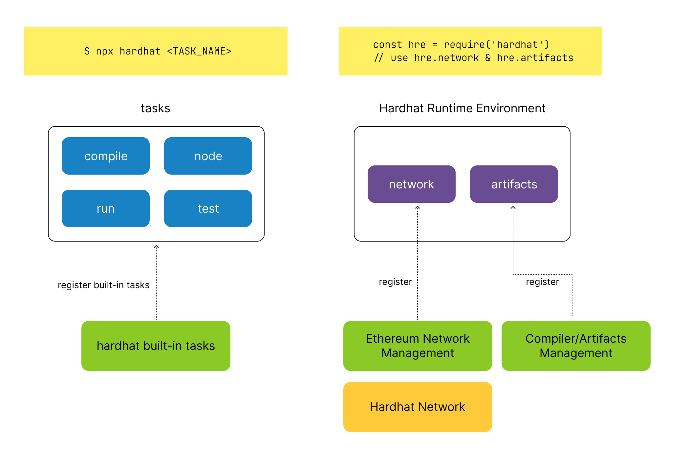
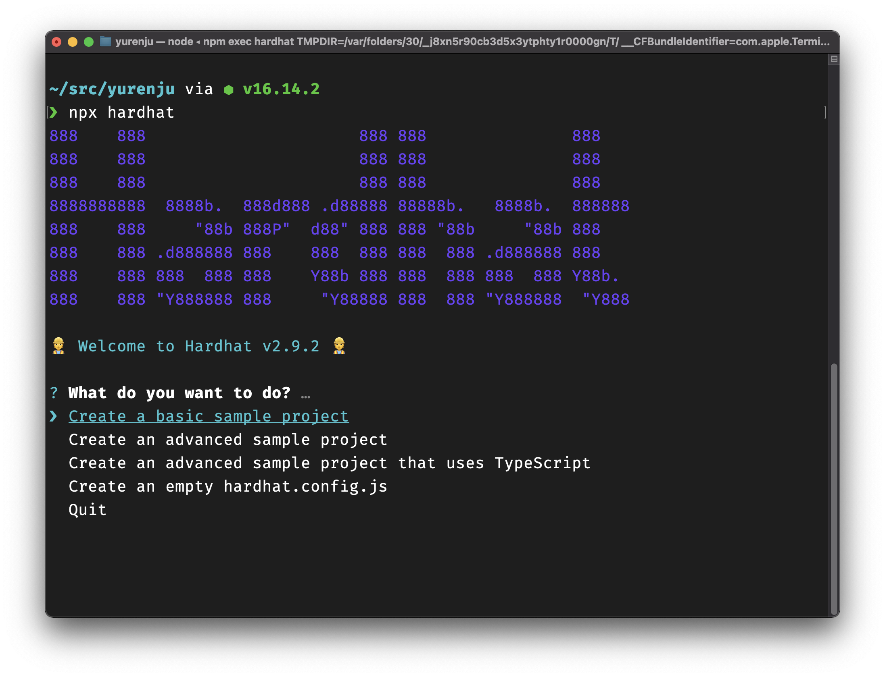
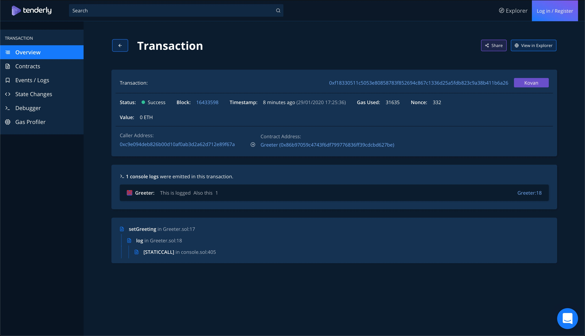
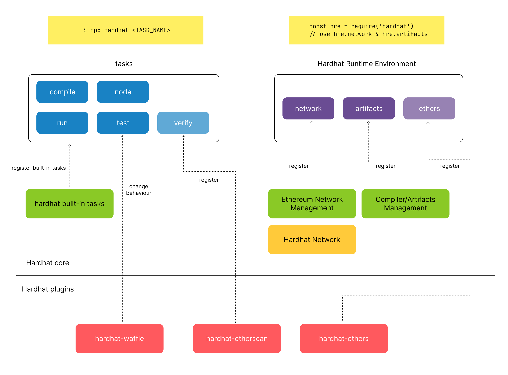

撰寫 Solidity 智能合約概括上來說跟寫一般程式相同，需要撰寫、除錯、測試以及佈署等工作，而不同之處在於智能合約運行在區塊鏈網路上，在開發過程中會需要本地開發測試用的網路以及佈署到不同網路（比如說測試網路 Rinkeby, Ropsten 或是 production 網路 mainnet 等）網路管理的功能，同時佈署到網路上之後，還會需要編譯後的產物 (artifact) 包括 ABI (Application binary interface) 來跟區塊鏈網路上的智能合約互動。

Hardhat 是一套開發智能合約用的開發工具，內建了區塊鏈網路設定管理以及編譯器管理的功能，並且提供一個彈性的框架讓各種 plugin 可以延伸 Hardhat 來提供各式各樣的功能。本篇文章會介紹 Hardhat 的基礎結構以及所提供的各種功能讓開發者可以更加理解與活用這個工具。

本文章的運行環境統一都是 Node.js v16 運行在 macOS 環境，其他作業系統可能會有些微的不同。

## Hardhat 架構
Hardhat 的核心基礎是由 Ethereum 網路設定管理、編譯器與產物管理與 Hardhat Network 組成，並且透過一個彈性的擴充框架可以架構在 hardhat 上面提供更多功能。



這裡面的元件怎麼互動我們會在後面的章節慢慢講解，不過首先我們會先需要設定一個範例專案來協助了解 hardhat。

## 設定範例專案
為了說明 hardhat 的架構與各種功能，在這邊先設定一個由 hardhat 提供的一個範本專案，請先建立一個目錄 `hardhat-sample` 並且在裡面執行 hardhat 指令：

```shell
$ mkdir hardhat-sample
$ cd hardhat-sample
$ npx hardhat
```

npx 是一個由 node.js 提供的指令可以執行由 node.js 撰寫的 CLI 程序，如果該 CLI 程序還沒安裝，他會詢問你是否要安裝並且從自動下載，所以首次執行時會詢問你是否要安裝 hardhat，按下確認即可繼續，接下來會看到 hardhat 的導引畫面。


選擇 `Create a basic sample project`，並且在接下來的問題都按 Enter 選擇預設值，hardhat 會開始安裝相關的套件，稍等一段時間會安裝完畢。

當安裝完畢之後再輸入一次 `npx hardhat` 就會顯示以下輸出：

```
$ npx hardhat

Hardhat version 2.9.2

Usage: hardhat [GLOBAL OPTIONS] <TASK> [TASK OPTIONS]

GLOBAL OPTIONS:

  --config           	A Hardhat config file. 
  --emoji            	Use emoji in messages. 
  --help             	Shows this message, or a task's help if its name is provided 
  // skip


AVAILABLE TASKS:

  accounts	Prints the list of accounts
  check   	Check whatever you need
  clean   	Clears the cache and deletes all artifacts
  compile 	Compiles the entire project, building all artifacts
  console 	Opens a hardhat console
  flatten 	Flattens and prints contracts and their dependencies
  help    	Prints this message
  node    	Starts a JSON-RPC server on top of Hardhat Network
  run     	Runs a user-defined script after compiling the project
  test    	Runs mocha tests

To get help for a specific task run: npx hardhat help [task]
```

到這邊就產生了一個範例用的專案了，除了可以看到 hardhat 有提供許多指令可以使用包含編譯、測試等等外，範例專案也包含了一些佈署用的腳本、範本智能合約以及測試。

## 基礎使用
在範例專案裡面有幾個比較重要的目錄與檔案：
- contracts 目錄：智能合約所在的目錄
- test 目錄：測試智能合約的 JavaScript 測試案例
- scripts 目錄：可以用 `hardhat run <SCRIPT>` 執行腳本的目錄
- hardhat.config.js 檔案：設定 hardhat 的設定檔

執行 `npx hardhat compile` 時，在 `contracts` 目錄的智能合約會被編譯，而編譯後的產物會寫到 `artifacts` 目錄底下，比如說編譯結束後會產生 `artifacts/contracts/Greeter.sol/Greeter.json` 這個就是合約的 abi，當佈署到 Ethereum 網路後就可以用這份檔案來跟合約互動。

執行 `npx hardhat test` 時則會執行在 `test` 目錄底下的所有測試案例，這邊的測試案例使用 mocha 測試框架撰寫，可以參考 [Mocha 的官方網站](https://mochajs.org/) 了解怎麼撰寫 mocha 的測試。

而執行 `npx hardhat run scripts/sample-script.js` 則會根據 `sample-script.js` 的內容把智能合約佈署在本地的專門為開發設計的 Ethereum 網路 - hardhat network 上面。

以下我們會從設定檔開始講解 hardhat 的設計方式。

## Hardhat 設定檔
Hardhat 設定檔的核心功能是設定 Hardhat 怎麼連結到 Ethereum 網路以及編譯器的設定管理，以這個範例專案來看設定檔長這樣：

```javascript
// 1. import plugin
require("@nomiclabs/hardhat-waffle");

// 2. add tasks
task("accounts", "Prints the list of accounts", async (taskArgs, hre) => {
  const accounts = await hre.ethers.getSigners();

  for (const account of accounts) {
    console.log(account.address);
  }
});

// 3. export configuration
module.exports = {
  solidity: "0.8.4",
};
```

整個設定檔分成三個部分。

第一個部分是匯入 `hardhat-waffle` 的延伸套件，會在執行測試案例時新增一些 Ethereum 特定的匹配語法讓撰寫測試案例可以更方便，而因為 `hardhat-waffle` 相依於 `hardhat-ethers`，所以其實雖然沒有明寫出來，但是 `hardhat-ethers` 也會被匯入進來。

第二個部分則是 hardhat 提供了一個可以為 hardhat CLI 新增額外指令的方式，在這邊添加了一個 `accounts` 的指令，印出所有測試用的帳號地址，可以執行 `npx hardhat accounts` 執行該命令。

第三部分其實才是 hardhat 組態設定的部分，最主要的設定是要連接的網路與編譯器的版本。而在這個範例用了一個最小化的設置，也就是只設定 solidity 的版本。

這個設定將會在需要編譯智能合約之前，檢查系統是否有這個版本的編譯器，如果沒有的話會從網路自動下載指定版本的 solc 編譯器。

不過在第二部分的 `accounts` 指令有一些細節還可以繼續延伸討論。

## HRE, Hardhat Runtime Environment
仔細看一下 `accounts` 指令的源碼：

```javascript
task("accounts", "Prints the list of accounts", async (taskArgs, hre) => {
  const accounts = await hre.ethers.getSigners();

  for (const account of accounts) {
    console.log(account.address);
  }
});
```

以及執行 `npx hardhat accounts` 的結果：

```shell
$ npx hardhat accounts                                          

0xf39Fd6e51aad88F6F4ce6aB8827279cffFb92266
0x70997970C51812dc3A010C7d01b50e0d17dc79C8
0x3C44CdDdB6a900fa2b585dd299e03d12FA4293BC
// ...
```

在 `accounts` 指令裡面，在 `taskArgs` 後面第二個參數是 `hre`，這是 Hardhat Runtime Enivonment 的縮寫。HRE 是一個可以讓擴充套件將功能提供給其他指令、腳本或是測試檔案使用的物件。比如說在 `accounts` 指令裡面就用了 `hre.ethers.getSigners()` 取得 signers，這個 `hre.ethers` 就是由 `hardhat-ethers` 所提供的。

如果像在 `accounts` 指令這種用 `task()` 初始化一個新的指令時，`hre` 會作為第二個參數被傳入，如此一來自訂的指令就可以透過 `hre` 來使用擴充套件所提供的功能，比如說 `hre.ethers.getSigners()` 就可以取得可以含有私鑰資訊並且可以發送交易的 Signer 物件。

除了 `hre.ethers` 是由 `hardhat-ethers` 提供以外，hardhat 本身有幾個內建的物件可以使用：

### hre.network
`hre.network` 提供關於網路目前的設置，比如說我們使用 `hre.ethers` 的時候不會需要設定連結到哪個區塊鏈網路是因為 `hardhat-ethers` 內部透過 `hre.network` 把網路設定好了。

### hre.artifacts
`hre.artifacts` 則提供了讀取編譯後的產物的功能，同樣的使用 `hre.ethers` 你會發現不需要設定 ABI，只要用 `getContractFactory()` 就可以直接取得 ContractFactory，比如說在 `sample-test.js` 裡面可以看到：

```javascript
const Greeter = await ethers.getContractFactory("Greeter");
```

這個的原因也是因為 `hardhat-ethers` 透過 `hre.artifacts` 讀取到了 ABI 的資訊，並且包裝成 `getContractFactory()` 讓開發者可以更簡易的取用到 ContractFactory。如果要自行讀取 artifact 資訊，可以直接透過 `hre.artifacts` 做到：

```typescript
hre.artifacts.readArtifact("Greeter")
```

### 測試案例與腳本取得 hre 的方式
在 `task()` 裡面可以透過第二的參數取得 `hre`，而在測試或是直接透過 `npx hardhat run <SCRIPT>` 執行的腳本，則可以用 `require()` 的方式拿到 hre：

```javascript
const hre = require("hardhat");
```

## Hardhat Network
在 `accounts` 指令的源碼還有另外一個細節： `hre.ethers.getSigners()` 回傳了測試用的帳戶，那這些帳戶到底是連結到哪個 Ethereum 網路的帳戶呢？在沒有指定哪一個區塊鏈網路的狀況下，hardhat 會連結到一個內部的區塊鏈網路：Hardhat Network。

Hardhat Network 是 hardhat 內建的 Ethereum 網路，主要針對開發 Ethereum Dapp 所設計來讓開發、除錯、測試可以更方便的進行。

Hardhat Network 有兩種運行模式，第一種是 in-process 的運作模式，當你執行各種 hardhat 指令如：

```shell
$ npx hardhat accounts
$ npx hardhat run ./scripts/sample-script.js
```

執行這些指令時，hardhat 會在執行指令前在同一個 process 啟動一個 hardhat network 的節點，當執行完畢的時候這個節點也會一併關閉，所有執行結果都不會儲存。這樣不管是在執行測試案例或是測試佈署等都非常方便。

但是如果是正在開發 Dapp 的前端網站時可能會需要透過 MetaMask 連接這個 hardhat network，或是說你需要一個節點可以持續運行，不會因為 hardhat 指令結束這個節點就會被關掉，那就可以用第二種執行方式，獨立的執行 hardhat network 節點：

```shell
$ npx hardhat node
```

執行成功後，再開另外一個終端機，並且把原本的指令加上 `--network localhost`：

```shell
$ npx hardhat run --network localhost ./scripts/sample-script.js
```

當腳本成功運行佈署成功後，可以在第一個終端機看到佈署成功的資訊，如果再跑一次指令就會看到第二個 Greeter 會被再次佈署到 hardhat network 上面。

hardhat network 比起一般的 Ethereum 網路添加了一些方便除錯的功能。

### solidity 實作的 console.log 模組
在 solidity 開發時一般來說是沒辦法印出資訊的，hardhat network 上面提供了 console.log 的功能可以印出資訊：

```javascript
import "hardhat/console.sol";

contract Greeter {
    string private greeting;

    constructor(string memory _greeting) {
        console.log("Deploying a Greeter with greeting:", _greeting);
        greeting = _greeting;
    }

	// skip
}
```

在 `npx hardhat node` 的視窗就可以看到建構子所印出的資訊。另外因為這個模組是採用標準的 solidity 撰寫，所以即使在不支援的環境程式也不會產生錯誤（但沒辦法印出訊息）。另外一個好處是 Tenderly 也有支援此功能。以下這張圖片來自於 [Tenderly 的 Twitter](https://twitter.com/TenderlyApp/status/1222839034881376256) 展示他們支援 console.log 的功能。




### Mainnet Forking
Mainnet Forking 是在 Production 環境可以測試、驗證智能合約非常重要的功能，ccwang 有撰寫了相關文章《[Hardhat mainnet forking：主網分叉](https://lundao.tech/blog/hardhat-forking-1)》可以前往閱讀。

### Logging
如果在 `hardhat.config.js` 設定啟用 logging 後，`npx hardhat node` 可以看到更詳細的除錯訊息有助於開發，在 hardhat 網路底下設置 `loggingEnabled: true` 可以開啟此功能：

```javascript
module.exports = {
  solidity: "0.8.4",
  networks: {
    hardhat: {
      loggingEnabled: true
    }
  }
};
```

開啟之後就可以看到送出交易的詳細資訊：

```javascript
eth_sendTransaction
  Contract deployment: Greeter
  Contract address: 0x8858eeb3dfffa017d4bce9801d340d36cf895ccf
  Transaction: 0x7ea2754e53f09508d42bd3074046f90595bedd61fcdf75a4764453454733add0
  From: 0xc783df8a850f42e7f7e57013759c285caa701eb6
  Value: 0 ETH
  Gas used: 568851 of 2844255
  Block: #2 - Hash: 0x4847b316b12170c576999183da927c2f2056aa7d8f49f6e87430e6654a56dab0

  console.log:
    Deploying a Greeter with greeting: Hello, world!

eth_call
  Contract call: Greeter#greet
  From: 0xc783df8a850f42e7f7e57013759c285caa701eb6

  Error: VM Exception while processing transaction: revert Not feeling like it
      at Greeter.greet (contracts/Greeter.sol:14)
      at process._tickCallback (internal/process/next_tick.js:68:7)
```

更多關於 hardhat network 的資訊可以閱讀官方網站的文件：[Hardhat Network | Hardhat](https://hardhat.org/hardhat-network/)。

## 結語
Hardhat 本質上來說是由幾個元件構成：
- 組態管理：透過 hardhat.config.js 進行設定，同時擴充套件也可以新增額外的屬性來設定擴充套件
- Ethereum 網路管理：透過 hardhat.config.js 裡面的 `networks` 屬性來設定網路，並且透過 `hre.network` 提供給其他元件使用網路資訊
- 編譯器管理：透過 hardhat.config.js 裡面的 `solidity` 屬性設定編譯器與自動下載，並且透過 `hre.artifacts` 提供編譯器產物的資訊給其他元件使用
- 擴充套件架構：提供了一個擴充套件的架構讓大部分的功能都透過擴充的方式提供，讓擴充套件可以改變原本 hardhat 的運作方式、新增指令或是透過 `hre` 提供功能給其他元件使用

由於 hardhat 本身提供這套彈性的架構，這樣可以讓大多數主要的功能都可以透過擴充套件來針對不一樣的需求添加功能到專案裡面去。



以 `hardhat-waffle`, `hardhat-etherscan` 與 `hardhat-ethers` 這三個套件為例，正好就是三種不一樣的延伸方式，`hardhat-waffle` 改變 hardhat 原本的行為，添加更多測試用的匹配工具；`hardhat-etherscan` 新增 `verify` 指令；而 `hardhat-ethers` 則在 `hre` 新增了 `hre.ethers` 讓其他元件可以更方便的讓 ethers.js 整合入 hardhat。

由於 hardhat 本身可以探討的主題還很多，除了目前以有的 hardhat 文章外，我們也還規劃了其他跟 hardhat 相關的主題，如果你有興趣加入寫作行列可以到 [GitHub Discussion](https://github.com/lun-dao/LunDAO/discussions/87) 一起討論！