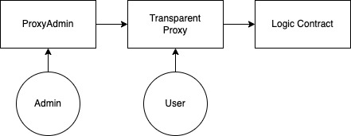
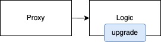
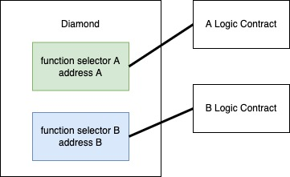

本文為 Diamond 101 系列的第一篇文章，將解釋什麼是可升級合約、常見的實作以及不同實作之間的設計。

<!--truncate-->

## Proxy 的組成


可升級合約顧名思義就是可以更新邏輯的合約，實作大多基於 Proxy。Proxy 是一種 Solidity 的 design pattern，將資料與邏輯分開處理，只要能替換掉邏輯，就能升級。

### Delegatecall

首先需要先來補充一點背景知識。目前所有的 Proxy 都是 `delegatecall` 的應用。簡單說明 `delegatecall` 就是以別的合約的函式來操作發出 `delegatecall` 的合約的 storage。而一般的合約調用則是以自己的函式操作自己的 storage。舉例來說，當 A 合約對 B 合約調用 `delegatecall` 時，B 合約的函式會被調用，但是對 storage 的寫入都會執行 A 合約上。附上[常見的 delegatecall 實作](https://github.com/OpenZeppelin/openzeppelin-contracts/blob/5a75065659a65e65bb04890192e3a4bcb7917fff/contracts/proxy/Proxy.sol#L22-L45)。

Delegatecall 也衍生出不少有趣的 EIP，例如 [EIP-1167](https://eips.ethereum.org/EIPS/eip-1167)，以最小的成本複製一個合約。

### fallback 與 receive

有關合約調用的交易 (transaction) 的 data 欄位不會空著，前面 4 個 bytes 為 function selector，用來讓 EVM 知道要執行合約中的哪段 bytecode。要是沒有 function selector 或是 function selector 不在合約中怎麼辦？這時則會看合約有沒有實作 `fallback` 或是 `receive`，兩者觸發的條件如下：

- `fallback`:
  - 合約中沒有對應的 function selector
  - 沒有 receive 時
- `receive`:
  - 交易的 data 為空 (不管 value 為多少)

Proxy 合約中不會紀錄邏輯合約 (logic contract) 每一個 function selector，就會利用 fallback 的特性處理所有的合約調用，將所有的合約調用都 delegatecall 至邏輯合約 (logic contract)。可以來看一下 [Openzeppelin](https://github.com/OpenZeppelin/openzeppelin-contracts/blob/master/contracts/proxy/Proxy.sol) 提供的實作，就是 delegatecall 跟 fallback, receive 的組合拳。

## Transparent Proxy



架構圖如上，來看一下 Openzeppelin 的介紹

> The way we deal with this problem is via the transparent proxy pattern. The goal of a transparent proxy is to be indistinguishable by a user from the actual logic contract.

這是何意呢？主要是要讓使用者跟邏輯合約 (logic contract) 緊緊連結在一起，不過這樣寫也很讓人難懂。簡單來說就是使用者所發起的合約調用都要以 delegatecall 調用邏輯合約 (logic contract)，而 admin 所發起的合約調用永遠不會到邏輯合約。

示意圖如下

| msg.sender | owner()             | upgradeTo()    | transfer()           |
| ---------- | ------------------- | -------------- | -------------------- |
| admin      | returns proxy.owner | upgrades proxy | reverts              |
| user       | returns ERC20 owner | reverts        | sends ERC20 transfer | 

Openzeppelin 採用 EIP-1967 作為實作。實作上，Proxy 裡面的每個管理 proxy 的 function 都會加上身份驗證的流程，只讓 admin 可以調用。但是為何還要一個而 ProxyAdmin 呢？ProxyAdmin 主要用途是為了執行查詢的用途還有讓 owner 解放。

舉個例子，`admin()` 應該要是個 `view function` 但是因為 fallback 的關係不能標示 `view`，需要利用另外一個合約再包裝一層才能標示 `view`。此外 admin 也可能同時是 user，把權限交給 ProxyAdmin 同時有更好的 function interface 可以調用，也可以讓 admin 解開限制。

**Proxy 中 admin function 的舉例**

```javascript
modifier ifAdmin() {
    if (msg.sender == _getAdmin()) {
        _;
    } else {
        _fallback();
    }
}

function admin() external ifAdmin returns (address admin_) {
    admin_ = _getAdmin();
}
```

**ProxyAdmin 中對 admin function 的封裝**

跟 `staticcall` 一起使用，才能標示為 `view`

```javascript
function getProxyAdmin(TransparentUpgradeableProxy proxy) public view virtual returns (address) {
    (bool success, bytes memory returndata) = address(proxy).staticcall(hex"f851a440");
    require(success);
    return abi.decode(returndata, (address));
}
```

## UUPS



UUPS 的規格和介面是基於 EIP-1822，不過 Openzeppelin 也是和 EIP-1967 搭配作為實作。Transparent Proxy 最大的差異在做 upgrade 的函式同樣也放在邏輯合約中，讓 Proxy 只留 fallback 和 receive。升級合約也需要透過 delegatecall 調用邏輯合約。合約架構更為精簡，不用額外的身份驗證或是額外的 Admin 合約。

## Diamond



Diamond 怎麼升級跟 Transparent Proxy 跟 UUPS 截然不同。Transparent Proxy 跟 UUPS 每次更新都需要將整份合約更新，除了不需要更新的部分也連帶更新了，而且因為合約大小有上限 (EIP-170) 也不能在單個合約一直增加新的邏輯。所以有人提出了 EIP-2535，主要是建立一張表來註冊不同的 function selector。有趣的地方在於可以註冊不同合約的 function selector。也就是說 delegatecall 可以調用的合約不只限於一個。除了彈性變大之外，也可以只新增或是修改其中一個 function selector。

## Reference

- EIPS
    - [EIP-7 Delegatecall](https://eips.ethereum.org/EIPS/eip-7)
    - [EIP-170 Contract code size limit](https://eips.ethereum.org/EIPS/eip-170)
    - [EIP-1167 Minimal Proxy Contract](https://eips.ethereum.org/EIPS/eip-1167)
        - 進階閱讀: [Deep dive into the Minimal Proxy contract](https://blog.openzeppelin.com/deep-dive-into-the-minimal-proxy-contract/)
    - [EIP-1822 Universal Upgradeable Proxy Standard (UUPS)](https://eips.ethereum.org/EIPS/eip-1822)
    - [EIP-1967 Standard Proxy Storage Slots](https://eips.ethereum.org/EIPS/eip-1967)
    - [EIP-2535 Diamonds, Multi-Facet Proxy](https://eips.ethereum.org/EIPS/eip-2535)
- [Solidity 0.6.x features: fallback and receive functions](https://blog.soliditylang.org/2020/03/26/fallback-receive-split/)
- [OpenZeppelin Blog: The transparent proxy pattern](https://blog.openzeppelin.com/the-transparent-proxy-pattern/)
- [Deconstructing a Solidity Contract — Part III: The Function Selector](https://blog.openzeppelin.com/deconstructing-a-solidity-contract-part-iii-the-function-selector-6a9b6886ea49/)
- [UUPS Proxies 使用文](https://medium.com/taipei-ethereum-meetup/uups-proxies-%E4%BD%BF%E7%94%A8%E6%96%87-6210c81a946f)
