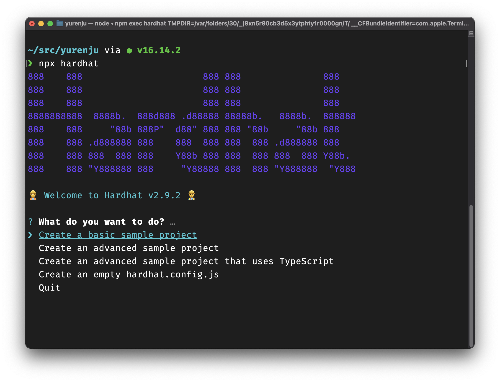

撰寫一般程式語言如 node.js 時，通常只要準備執行環境與編輯器就可以開始進行開發了。而開發 Solidity 則有些許不同，由於程式會需要跑在區塊鏈網路上，所以這個執行環境會比較複雜，會需要透過 RPC 連接並且佈署到區塊鏈網路上面並且執行、除錯與測試。

Hardhat 就是開發 Solidity 智能合約時所需要的開發工具，除了內建一個開發用的本地區塊鏈網路 Hardhat Network 外還打造了一套 plugin 系統讓許多跟區塊鏈相關的工具可以整合到 hardhat 讓開發者可以更容易進行開發、除錯、測試等，同時 Hardhat 針對 TypeScript 的支援比起其他類似工具還要優良，這在撰寫測試時會有很大的幫助。

本文將會簡介 hardhat 的用法與跟其他工具比較的優勢。

<!--truncate-->

文中的運行環境統一都是 Node.js v16 運行在 macOS 環境，其他作業系統可能會有些微的不同，但差別應該不大。

## 設定範例專案
為了說明 hardhat 的各種功能，在這邊先設定一個由 hardhat 提供的一個範本專案，請先建立一個目錄 `hardhat-sample` 並且在裡面執行 hardhat 指令：

```shell
$ mkdir hardhat-sample
$ cd hardhat-sample
$ npx hardhat
```

npx 是一個由 node.js 提供的指令可以執行由 node.js 撰寫的 CLI 程序，如果該 CLI 程序還沒安裝，他會詢問你是否要安裝並且從自動下載，所以首次執行時會詢問你是否要安裝 hardhat，按下確認即可繼續，接下來會看到 hardhat 的導引畫面。


選擇 `Create a basic sample project`，並且在接下來的問題都按 Enter 選擇預設值，hardhat 會開始安裝相關的套件，稍等一段時間會安裝完畢。

當安裝完畢之後再輸入一次 `npx hardhat` 就會顯示以下輸出：

```
$ npx hardhat

Hardhat version 2.9.2

... skip

AVAILABLE TASKS:

  accounts	Prints the list of accounts
  check   	Check whatever you need
  clean   	Clears the cache and deletes all artifacts
  compile 	Compiles the entire project, building all artifacts
  console 	Opens a hardhat console
  flatten 	Flattens and prints contracts and their dependencies
  help    	Prints this message
  node    	Starts a JSON-RPC server on top of Hardhat Network
  run     	Runs a user-defined script after compiling the project
  test    	Runs mocha tests

To get help for a specific task run: npx hardhat help [task]
```

到這邊就產生了一個範例用的專案了，除了可以看到 hardhat 有提供許多指令可以使用包含編譯、測試等等外，範例專案也包含了一些佈署用的腳本、範本智能合約以及測試。

## Hardhat 設定檔
專案的根目錄底下會有一個 `hardhat.config.js` 檔案，這是設置 hardhat 的地方，你可以在這邊啟用 hardhat plugin、加入一些常用的工作變成一個新的 hardhat 指令，也可以在這邊設定編譯器與連接到不同的網路。

預設的 `hardhat.config.js` 如下：

```javascript
// 1. import plugin
require("@nomiclabs/hardhat-waffle");

// 2. add tasks
task("accounts", "Prints the list of accounts", async (taskArgs, hre) => {
  const accounts = await hre.ethers.getSigners();

  for (const account of accounts) {
    console.log(account.address);
  }
});

// 3. export configuration
module.exports = {
  solidity: "0.8.4",
};
```

註解所標示的三大部分，各別是啟用 `hatdhat-waffle` plugin、加入一個新指令跟設定 hardhat 所用的編譯器。

## 編譯 Solidity 檔案
執行 `npx hardhat compile` 時，在 `contracts` 目錄的智能合約會被編譯，而編譯後的產物 (Artifacts) 會寫到 `artifacts` 目錄底下，比如說編譯結束後會產生 `artifacts/contracts/Greeter.sol/Greeter.json` 這個就是合約的 abi，當佈署到 Ethereum 網路後就可以用這份檔案來跟合約互動。

編譯 Solidity 檔案的編譯器版本可以在 `hardhat.config.js` 裡面設定，上面的範例指定 `solidity: "0.8.4"` 是最基礎的設定，還有一些也可以設定的項目：

- 最佳化：設定要不要開啟編譯最佳化以及最佳化的程度，預設是關閉最佳化[^註1]
- EVM 版本：EVM 在不同的分岔後會多出一些新的功能或格式上的差異，這邊也可以指定

設定的方法如下，更詳細的資訊可以參考 hardhat 官方網站裡面的 [Compiling your contracts](https://hardhat.org/guides/compile-contracts.html) 一節。
```javascript
solidity: {
  version: "0.5.15",
  settings: {
    optimizer: {
      enabled: true, // 啟用最佳化
      runs: 200 // 最佳化的評估方式
    },
    evmVersion: "istanbul" // 可以選擇 instanbul, berlin, london 等
  }
}
```

而 `runs` 參數是開發者評估這個合約預估會執行幾次，提供給編譯器執行最佳化時的參考依據，可以閱讀 [LunDAO discord 討論](https://discord.com/channels/927177880318922802/927177880318922807/967717928290107392)。

如果你遇到編譯器與 solidity 檔案中所指定的版本沒有相符時，也可以指定多重編譯器版本，比如說你自己的合約用 0.6，但是你所引用的 openzeppelin 合約則是 0.5，此時可以在 Hardhat 設定檔裡面指定多種不同版本的 solidity。

```javascript
module.exports = {
  solidity: {
    compilers: [
      {
        version: "0.5.5",
      },
      {
        version: "0.6.7"
      },
    ],
  },
};
```

## 執行測試
執行 `npx hardhat test` 會開始執行測試，執行測試前 hardhat 會先將所有的智能合約編譯完畢後才執行，在 `test/` 目錄底下的所有 JavaScript 測試檔案都會被執行。

我們這邊對照著 solidity 與測試檔案一起看：

```javascript
// Greeter.sol
//SPDX-License-Identifier: Unlicense
pragma solidity ^0.8.0;

import "hardhat/console.sol";

contract Greeter {
    string private greeting;

    constructor(string memory _greeting) {
        console.log("Deploying a Greeter with greeting:", _greeting);
        greeting = _greeting;
    }

    function greet() public view returns (string memory) {
        return greeting;
    }

    function setGreeting(string memory _greeting) public {
        console.log("Changing greeting from '%s' to '%s'", greeting, _greeting);
        greeting = _greeting;
    }
}
```

```javascript
// sample-test.js
const { expect } = require("chai");
const { ethers } = require("hardhat");

describe("Greeter", function () {
  it("Should return the new greeting once it's changed", async function () {
    const Greeter = await ethers.getContractFactory("Greeter");
    const greeter = await Greeter.deploy("Hello, world!");
    await greeter.deployed();

    expect(await greeter.greet()).to.equal("Hello, world!");

    const setGreetingTx = await greeter.setGreeting("Hola, mundo!");

    // wait until the transaction is mined
    await setGreetingTx.wait();

    expect(await greeter.greet()).to.equal("Hola, mundo!");
  });
});

```

測試檔案會把 Greeter 合約透過 `ethers.getContractFactory("Greeter")` 取得 Factory 合約，並且透過  `Greeter.deploy("Hello, world!")` 佈署到本地的測試網路裡面，到等佈署成功後就開始進行測試。

這個本地測試網路 Hardhat Network 會在測試結束之後銷毀所有測試所佈署上去的合約與狀態。

## 佈署
Hardhat 官方雖然沒有提供佈署工具，但是可以透過 `hardhat script` 指令做到。下達以下指令之後可以佈署到內建的 Hardhat network：

```shell
$ npx hardhat run ./scripts/sample-script.js 
Deploying a Greeter with greeting: Hello, Hardhat!
Greeter deployed to: 0x5FbDB2315678afecb367f032d93F642f64180aa3
```

但由於是佈署於本地的開發用網路 Hardhat Network，而這個區塊鏈網路在指令執行結束後就會銷毀所有在上面佈署的合約與狀態，所以除了執行指令的當下可以呼叫函式測試外沒有其他可以測試的方法。

此時可以在 `hardhat.config.js` 裡面加入一個 Ethereum 的網路如 mainnet 或是測試網路 Rinkeby, Ropsten 來進行測試。

比如說你可以先用 MetaMask 在測試網路 Rinkeby 建立一個帳號，取得測試用的 ETH 並且匯出註記詞。然後到 [Infura](https://infura.io/) 或是 [alchemy](https://www.alchemy.com/) 申請一個 API 來存取 Rinkeby，並且改設定檔 `hardhat.config.js`：

```javascript
module.exports = {
  solidity: "0.8.4",
  networks: {
    rinkeby: {
        url: "https://rinkeby.infura.io/v3/<INFURA_PROJECT_ID>",
        accounts: {
            mnemonic: "<YOUR_MNEMONIC>",
        },
        chainId: 4, // 可以查看 https://chainlist.org/
    }
  },
};
```

設定完畢後就可以用相同的指令但加入 `--network` 佈署到 Rinkeby 網路上面：

```shell
$ npx hardhat run --network rinkeby ./scripts/sample-script.js
```

這樣這份 Greeter 合約就會被佈署到 Rinkeby 測試網路上面了。

## 比較
跟 Hardhat 類似的工具有幾個如 Truffle 與 Remix，但是 Hardhat 跟其他的工具比較有些額外的好處。

### 與 Truffle 比較
[Truffle](https://trufflesuite.com/) 原生內建了 web3.js 函式庫，不過舊的版本裡面混用了不相容的兩種 web3.js 函式庫，開發上經常會很困惑。不過筆者很久沒用 Truffle 了，或許現在已經沒有這個問題，而兩種 web3.js 版本導致的問題是不知道怎麼用 web3 函式庫也帶出了下一個優勢 - TypeScript 支援。

Hardhat 原生就是採用 TypeScript 開發，這在採用 Hardhat 進行智能合約開發時，清楚的型別在製作開發工具以及撰寫測試上面能夠更有效率，這在後續的文章會在解釋如何設定 TypeScript 以及他所提供的優勢。

另外有一些 Truffle 提供的工具我一直都沒找到好用的地方，比如說 Truffle 的鏈上 migration 機制都沒有合適合理的使用方式，而重新將 `mocha` 的 `describe()` 包裝成 `contract()` 提供的 [clear-room feature](https://trufflesuite.com/docs/truffle/testing/writing-tests-in-javascript/#use-contract-instead-of-describe) 一直都沒感受到特別實用的地方，而全域的 `artifacts.require()` 也讓人感到有些困惑。

相較起來 Hardhat 通常都是比較明確的撰寫方式如下面的例子，我覺得比較容易理解與閱讀。
```javascript
// truffle's implicit global function `artifacts`
const MetaCoin = artifacts.require("MetaCoin"); // where does artifacts come from?
MetaCoin.deployed()

// hardhat's explicit function
const { ethers } = require("hardhat"); // explicitly import via hardhat
const Greeter = await ethers.getContractFactory("Greeter");
```

### 與 Remix IDE 比較
[Remix](https://remix-project.org/) 比較適合快速的測試與除錯，但以網頁作為基礎開發的開發套件比較不適合團隊開發使用。一般來說如果想要快速測試時，Remix 會更加的合用，但是如果想要放在 Github 讓團隊一起協作開發，Hardhat 或是 Truffle 會比較適合。

### 新工具 foundry
[Foundry](https://github.com/foundry-rs/foundry) 是 LunDAO 的 discord 群組上面最近討論的工具，看起來比起 Hardhat 把 Hardhat Network 跟框架打包在一起，Foundry 提供了一個更獨立的開發工具，看起來是個不錯的新選擇，或許之後也會撰文介紹。

## 結論
如同上面的比較，筆者自己是比較偏好 Hardhat，同時也在團隊中採用了超過兩年的時間，在 Perpetual Protocol V1 到 V2 的轉換也還是採用了相同工具，這也讓 hardhat 成為了團隊的必備工具。

而 Hardhat 上面豐富的工具如 [hardhat-deploy](https://github.com/wighawag/hardhat-deploy), [hardhat-etherscan](https://hardhat.org/plugins/nomiclabs-hardhat-etherscan.html) 與 [hardhat-gas-reporter](https://github.com/cgewecke/hardhat-gas-reporter) 等等都讓開發工作能夠更順利的進行。

然而 hardhat 提供的彈性框架有時候在開發上也會造成一些困擾，接下來 Hardhat 系列文章將會更深入的解釋 Hardhat 結構與原理，當在大量使用 Hardhat 可以更明白發生了什麼事情以及如何解決使用 Hardhat 會遇到的問題。

[^註1]: 關閉最佳化時仍會有部分的最佳化，請參考 [LunDAO discord 討論](https://discord.com/channels/927177880318922802/927177880318922807/967723565623423006)