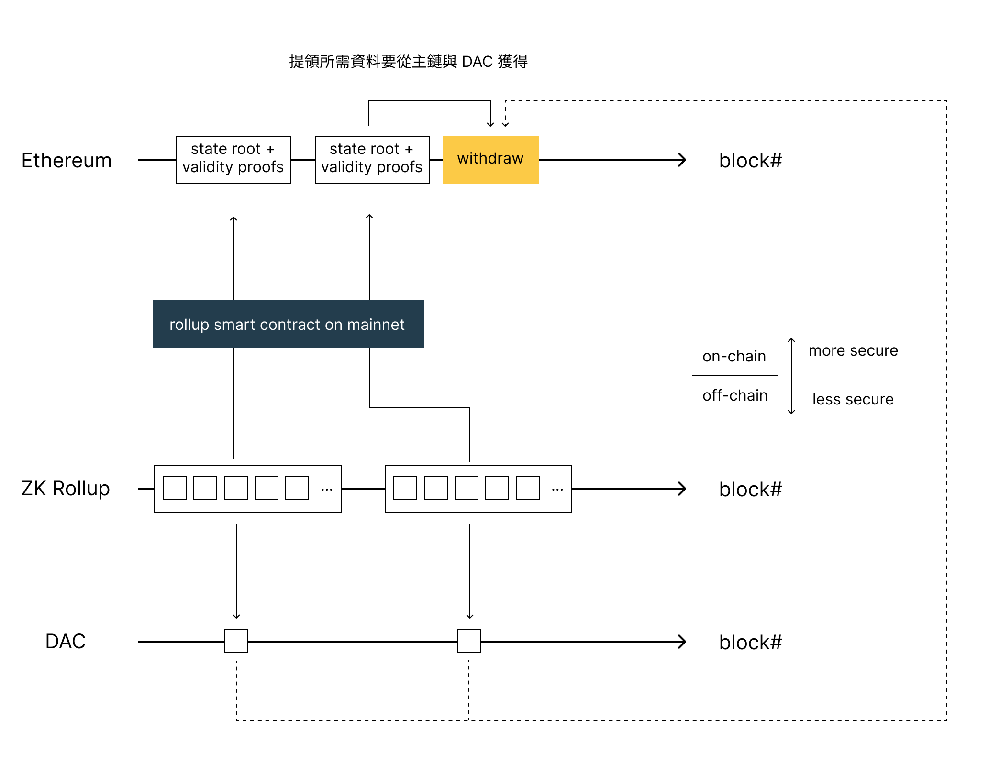

在上篇文章《[資料可用性（一）：Rollup](rollup-data-availability)》解說了什麼是資料可用性，而 Rollup 透過將交易歷史資料放在主鏈上獲得了可靠的資料可用性，同時也因為放在主鏈上的關係高昂的成本讓使用者卻步。本文將會介紹數個鏈下的資料可用性解決方案來討論是否有更好的方式可以在安全性以及交易成本之間取得一個平衡。

<!--truncate-->

### Validium

Validium 是一種 zk rollup 的變形，一樣透過密碼學的方式來證明所有交易跟狀態都正確的被執行，不同之處在於 Validium 將歷史交易資料放到鏈下 (off-chain) 儲存，鏈上的智能合約裡面就只剩 State root 以及正確性證明。

由於把佔據最大資料量的歷史交易資料放到鏈下儲存，根據 [Matter labs 引用的數據](https://blog.matter-labs.io/zkrollup-vs-validium-starkex-5614e38bc263)，Validium 可以到達每秒 9000 筆以上的交易，但是要如何保存鏈下資料就變成了另一個安全性問題。

相較於 Rollup 在鏈上保存交易歷史資料，代表隨時可以從主鏈上面取得這些資料用於提領與其他用途，鏈下儲存方案如果可以正常的存取資料時一切都很美好，但是如果資料提供者跟使用者的利益不一致時，有可能會不願意提供資料讓使用者提領資金；另外其他的可能是資料提供者故障時就無法提供資料。

目前資料提供者有幾種解決方案，比如說透過一個資料可用性委員會 (Data availability committee, DAC) 提供資料，組成的成員是公正可信任的第三方代表。但這樣並不能解決利益衝突的問題。另外也可以隨機的把這些資料分配給 Validium 網路上面的驗證者來解決這樣的問題，因為隨機分配的關係，所以驗證者如果跟特定使用者利益上有衝突，也不見得可以阻止資料的供給。

總歸來說 Validium 減低交易成本而提升了交易效能，但是在安全性上則不比儲存在主鏈上面安全，這樣的取捨可以考慮 Validium 是使用在怎麼樣的場景來決定是否採用該方案。

目前 StarkWare 的 StarkEx 是可以運行在 zk rollup 模式或是 Validium 模式，並且透過 DAC 提供資料可用性。

### Volition
Volition 則是 Validium 的延伸，使用者可以選擇資料要儲存在鏈上或鏈下。如果儲存在鏈上那就是跟 ZK Rollup 相同儲存方式，如果儲存在鏈下那就是 Validium 模式。因為執行的每筆交易所需要的安全性不同，而且由於正確性證明與 State Root 都有上傳到主鏈。會需要根資料提供者索取的主要是歷史交易資料以及狀態相關的資訊。

使用者可以根據自己的需求決定如何要把資料儲存在哪裡。如果需要高安全性，可以選擇儲存在鏈上也就是 rollup 模式；如果需要低成本的高速交易就可以選擇鏈下儲存方案也就是 validium 模式。

zkPorter 是 zkSync 的 Volition 解決方案，讓使用者決定自己要採用高安全性還是高性能的交易，並且兩邊的資料是可以互通的。

### Metis (Optimistic Validium?)
[Metis](https://www.metis.io/) 採用了一個比較特殊的解決方式，Metis 將執行環境所需的資料放在鏈下儲存，也就是類似 Validium 的解決方案，但他是一種 Optimistic Rollup 的變形，所以並沒有正確性證明 (Validity Proof) 上傳到主鏈，取而代之的只有 State Root 在鏈上。當使用者提出詐欺證明的時候，會需要從鏈下的資料提供者取得交易以及狀態來產生詐欺證明。

這樣的解決方案會有資料提供者跟使用者有利益衝突的問題。

目前並沒有一個名詞定義這樣的擴容方案，不過依照取名的邏輯在《[A snapshot of the current rollup ecosystem](https://www.alexbeckett.xyz/a-snapshot-of-the-current-rollup-ecosystem/)》一文中提到可以暫時命名為 Optimistic Validium。這樣的解決方案比起 Optimistic Rollup 的安全性更低，同時無法在主鏈上獲得資料可用性的保證。

### Adamantium
Adamantium 是一種由 [StarkWare 提出](https://ethresear.ch/t/adamantium-power-users/9600) 更進階的解決方案，由於資料可用性最主要影響的地方會是提領時是否即時可用，以上的解決方法要不是放在主鏈，成本較高但是比較安全；不然就是放在鏈下，成本較低但是比較不安全。

Adamantium 則是一種「自己的安全自己顧」的概念，使用者必須要有自行架設一台機器隨時上線並且維護跟特定使用者有關的所有資料，並且與其他 Adamantium 基礎設施一起驗證安全性。

這樣的作法讓自己的安全性完全由自己的設備所掌控，同時可以享用高性能的交易，缺點就是使用者必須要有隨時上線的機器，如果有無法提供資料的狀況發生時，Adamantium 會自動的把資金提領到主鏈避免後續產生其他問題。

### 同場加映：Celestia
Celestia 是一個新的區塊鏈模組化解決方案。原本 Ethereum 是把執行環境跟執行環境所需的資料綁在一起，而 Celestia 則是用模組化的方式把「執行環境所需的資料提供」獨立成一個層級 (layer)，並且也把執行環境獨立成另外一個層級。

這樣的模組化環境讓 Rollup 以及 Validium 都會有不一樣的設計方式，以後有機會可以再另闢文章介紹 Celestia。

## 結論
不管是 Rollup 或是延伸出來的各種解決方案，所有專案與研究都是希望在安全性以及交易性能取得一個平衡點。

除了從主鏈方面來解決的 [EIP-4488](https://eips.ethereum.org/EIPS/eip-4488) 與 [EIP-4844](https://eips.ethereum.org/EIPS/eip-4844) 外，本文所提到的鏈下提供資料可用性的 Validium, Volition 以及 Adamantium 都試圖用其他方式讓安全性用其他方式保證的前提，降低交易成本而提高交易效能，用不同的切入點來解決資料可用性的問題。

目前除了 Validium 已經由 StarkWare 提供解決方案外，其他的資料可用性解決方案都還在積極的開發中，想必在接下來的幾個月不同解決方案都還會有更多開發進度釋出。再加上 zkSync 目前已經發佈至測試網路的 zkEVM，以及 Arbitrum 與 Optimism 接下來的 Nitro 與 Bedrock 升級，這些積極的開發進度都顯示著目前激烈的擴容方案競爭。

期待接下來各種擴容方案的發展！

## 參考資料
- [A snapshot of the current rollup ecosystem (alexbeckett.xyz)](https://www.alexbeckett.xyz/a-snapshot-of-the-current-rollup-ecosystem/)
- [Validium | ethereum.org](https://ethereum.org/en/developers/docs/scaling/validium/)
- [重返以太的號角 - Layer 2 簡介 by 林修平（Nic Lin） - YouTube](https://www.youtube.com/watch?v=gHYKbUV5BI8)
- [Adamantium - Power Users - Layer 2 - Ethereum Research (ethresear.ch)](https://ethresear.ch/t/adamantium-power-users/9600)