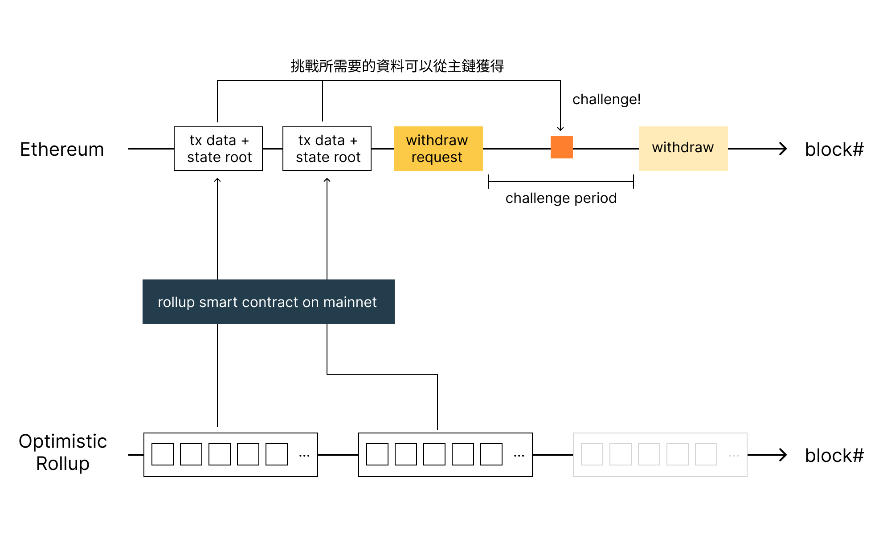
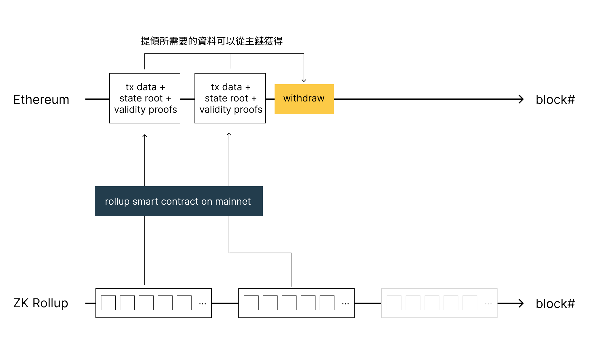

Rollup 是目前最主流的擴容解決方案 (Scaling solution)，從目前比較熱門的 Optimistic Rollup 如 Optimism 以及 Arbitrum，與著眼未來的 Zero Knowledge Rollup (ZK Rollup) 的 StartNet 與 zkSync 等等都在積極的開發中。

但不管是哪個解決方案他們要面對的共同問題都是資料可用性 (Data Availability)，這個因素會影響到每種 Rollup 的安全性與交易成本的取捨。

本篇文章會聚焦在講解什麼是資料可用性以及不同 Rollup 的差異為何。

<!--truncate-->

## 什麼是資料可用性？
資料可用性是指一個區塊鏈擴容方案的執行環境需要資料時，這些資料是否在當下可以取得，主要有兩種情況會需要取得資料。

第一是在執行交易時，會需要取得目前執行環境的狀態 (State) 與使用者的餘額 (Balance)，這樣才可以計算出執行交易後狀態跟餘額的變更。

第二種狀況是要離開擴容方案，把資產提領回主鏈時。此時一樣的會需要取得狀態、餘額資訊與歷史交易資料。這樣才知道特定的使用者是否可以提領出他所宣稱數量的資產回到主鏈上。

## 遊樂園與入場券點數的比喻
擴容方案的資料可用性可以用一個遊樂園與入場券點數來比喻。

這個遊樂園裡面有各種遊樂設施如摩天輪、大怒神等等，每個遊樂設施可以扣遊樂園的點數來遊玩，而點數則是在入場的時候用現金兌換，並且透過一個手機 app 儲值，如果玩得不夠還可以再購買。而這個點數是可以轉送給別人，同時當你離場的時候如果還沒用完，也可以兌換回現金。

而資料可用性 (Data Availability) 就是需要查驗你的點數時所需要的資料。

玩每個遊樂設施前，工作人員都會需要確認你還有多少點數，玩這個設施需要扣多少點數。而當你要離場兌換回現金的時候，售票處會需要查核你到底玩了多少遊樂設施，剩餘的點數跟你的遊玩紀錄與轉送給其他人的交易紀錄是否符合。

相較起來資料可用性在把兌換回現金（也就是離開擴容方案或是離開 Rollup）時會更為重要，因為在遊樂場裡面的各種遊玩紀錄都還在可控制的範圍內。當使用者決定把點數對換成現金離開時就會脫離遊樂園的範疇，此時會更慎重的確認數據是否正確，討論擴容方案的資料可用性時，通常也都會優先討論這樣的情境。

這些歷史資料儲存在哪邊是至關重要的。如果寫在入場處的本子上就很難同步，寫在資料庫或共用的試算表會是更好的方法。

但是如果這不是遊樂園，而是跟個人總資產息息相關金融服務如股票、貸款時，就會需要考慮更好的儲存方案。比如說中央銀行提供一個中央式的服務，讓所有點數可以紀錄在上面，這個點數可以是你買了多少股票、目前的貸款狀態等。

而在區塊鏈上為了考慮這些紀錄不可竄改的特性（就連中央銀行也不能），我們把他儲存在區塊鏈的主鏈上，並且透過各種去中心化的方式確保資料的變化都有可課責的對象。

## 各種擴容方案的資料可用性
### Optimistic Rollup

Optimistic Rollup 會將以下兩種資料透過主鏈上的智能合約附帶在 calldata 裡面上傳到主鏈：
- 打包壓縮過後的區塊，包含區塊內的所有交易資料
- 當下所有狀態透過 Merkle Tree 彙總後所得到的根狀態 (State Root)

主鏈上有完整交易歷史紀錄以及 State Root 可以訪問，這也代表 Optimistic Rollup 的資料可用性是非常好的，當主鏈正常運作的狀態下肯定可以取得這些資料。

因為 Optimistic Rollup 是樂觀假設所有交易與狀態都是正確的，沒有人作惡。除非有人提出解決爭端請求的詐欺證明 (Fraud Proof)，代表有人覺得狀態的數據不對。此時因為主鏈有所有交易歷史資料以及 State Root，提出詐欺證明的人可以利用主鏈上的資料提出證明，證明哪些狀態出了錯，而 Optimistic Rollup 佈署在主鏈上的智能合約可以用異議者提出的證明搭配上合約裡面已經有的 State Root 來確認狀態的正確與否。

這也是為什麼 Optimistic Rollup 會需要有七天的提領挑戰期，這是因為提領之後資金就不在 Rollup 管理的範圍了，而 Optimistic Rollup 預設是樂觀的假設狀態都是正確的，只有 State Root 這樣的資訊可以讓其他人透過詐欺證明的請求時來驗證。所以出金的時候會需要一段挑戰期，讓所有可能覺得數據不對的異議者可以有時間提出詐欺證明。

但是 Optimistic Rollup 的問題是 calldata 的成本過高。calldata 是一種 EVM 的資料型別，他是目前 EVM 上面最便宜的資料型別，但因為要塞下所有壓縮過的交易紀錄所以整體來說還是滿貴的。針對這樣的情況目前 Ethereum 主鏈有兩個提案試圖解決問題。

第一個是 [EIP-4488](https://eips.ethereum.org/EIPS/eip-4488) 試圖降低 calldata 的價格成本。另外一個是 [EIP-4844](https://eips.ethereum.org/EIPS/eip-4844) 新增一個資料型別 blob，此型別的成本相較於 calldata 更低並且在一定時間後（比如說一年後）會從節點移除該類型的資料。如果提案通過後，Rollup 就可以用 blob 取代目前的 calldata。因為這些交易資料在一定的時間後就不會需要了（比如說不會需要一年前的資料來產生詐欺證明），所以這樣的型別正好就適用於上傳 rollup 所需的資料。

### Zero Knowledge Rollup

跟 Optimistic Rollup 相同，zk rollup 一樣會透過主鏈上的智能合約上傳交易資料以及 State root 到主鏈，但 zk rollup 還額外上傳了正確性證明 (Validity Proof)，透過密碼學的方式證明所有交易與狀態都有被正確的執行。

這樣就不需要 Optimistic Rollup 的提領挑戰期，因為 zk rollup 在每個區塊上傳主鏈的當下就已經確認所有交易都被正確執行了，而不是樂觀的覺得所有狀態都是正確的被轉移，直到有人提出異議。

zk rollup 因為機制的不同，要上傳的資料比較小。所以交易成本又比起 Optimistic Rollup 低，每秒可以執行的交易數量較高。但同樣的問題是把資料放在 calldata 一樣有成本問題，同樣的可以透過 [EIP-4488](https://eips.ethereum.org/EIPS/eip-4488) 與 [EIP-4844](https://eips.ethereum.org/EIPS/eip-4844) 嘗試解決該問題。

相同的是在資料可用性方面，zk rollup 因為都把資料上傳到主鏈，資料可用性比起其他方案都是較好的，缺點則是交易成本都比較高，但相較之下 zk rollup 的交易成本還會比起 Optimistic rollup 更低。

## 小結
不管是 Optimistic Rollup 或是 ZK Rollup 由於將交易歷史資料放在主鏈上，這代表需要提領的時候都可以直接在主鏈上取得組合出提領所需的交易資料，如果需要提出詐欺證明時同樣的也可以在主鏈取得資料。

但是高昂的交易成本還是會讓使用者卻步，即使有 [EIP-4488](https://eips.ethereum.org/EIPS/eip-4488) 降低 calldata 價格成本與 [EIP-4844](https://eips.ethereum.org/EIPS/eip-4844) 新增更便宜的 blob 類型的資料。只要是儲存在主鏈就是會因為高安全性的關係有較高的成本。

那有沒有什麼可以在高安全性與交易成本之間的權衡方式呢？下篇文章《[資料可用性（二）：新形態的擴容方案](offchain-data-availability.md)》我們會介紹數種鏈下資料可用性解決方案：Validium, Volition 以及 Adamantium。

## 參考資料
- [A snapshot of the current rollup ecosystem (alexbeckett.xyz)](https://www.alexbeckett.xyz/a-snapshot-of-the-current-rollup-ecosystem/)
- [重返以太的號角 - Layer 2 簡介 by 林修平（Nic Lin） - YouTube](https://www.youtube.com/watch?v=gHYKbUV5BI8)