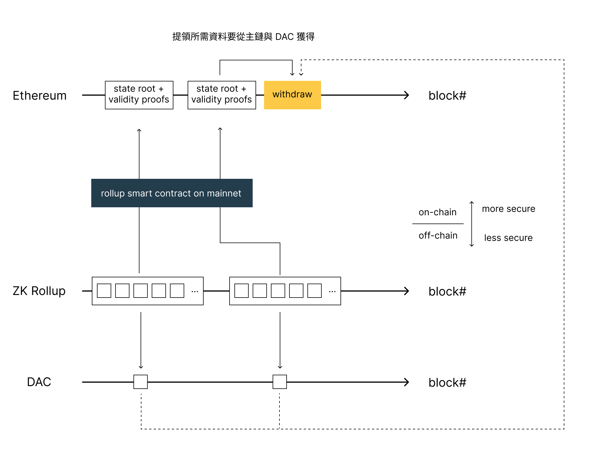

Rollup 是目前最主流的擴容解決方案 (Scaling solution)，從目前比較熱門的 Optimistic Rollup 如 Optimism 以及 Arbitrum，與著眼未來的 Zero Knowledge Rollup (ZK Rollup) 的 StartNet 與 zkSync 等等都在積極的開發中。

但不管是哪個解決方案他們要面對的共同問題都是資料可用性 (Data Availability)，這個因素會影響到每種 Rollup 的安全性與交易成本的取捨。

本篇文章會聚焦在講解什麼是資料可用性以及每個不同的解決方案的差異為何。

<!--truncate-->

## 什麼是資料可用性？
資料可用性是指一個區塊鏈擴容方案的執行環境需要資料時，這些資料是否在當下可以取得，主要有兩種情況會需要取得資料。

第一是在執行交易時，會需要取得目前執行環境的狀態 (State) 與使用者的餘額 (Balance)，這樣才可以計算出執行交易後狀態跟餘額的變更。

第二種狀況是要離開擴容方案，把資產提領回主鏈時。此時一樣的會需要取得狀態、餘額資訊與歷史交易資料。這樣才知道特定的使用者是否可以提領出他所宣稱數量的資產回到主鏈上。

## 遊樂園與入場券點數的比喻
擴容方案的資料可用性可以用一個遊樂園與入場券點數來比喻。

這個遊樂園裡面有各種遊樂設施如摩天輪、大怒神等等，每個遊樂設施可以扣遊樂園的點數來遊玩，而點數則是在入場的時候用現金兌換，並且透過一個手機 app 儲值，如果玩得不夠還可以再購買。而這個點數是可以轉送給別人，同時當你離場的時候如果還沒用完，也可以兌換回現金。

而資料可用性 (Data Availability) 就是需要查驗你的點數時所需要的資料。

玩每個遊樂設施前，工作人員都會需要確認你還有多少點數，玩這個設施需要扣多少點數。而當你要離場兌換回現金的時候，售票處會需要查核你到底玩了多少遊樂設施，剩餘的點數跟你的遊玩紀錄與轉送給其他人的交易紀錄是否符合。

相較起來資料可用性在把兌換回現金（也就是離開擴容方案或是離開 Rollup）時會更為重要，因為在遊樂場裡面的各種遊玩紀錄都還在可控制的範圍內。當使用者決定把點數對換成現金離開時就會脫離遊樂園的範疇，此時會更慎重的確認數據是否正確，討論擴容方案的資料可用性時，通常也都會優先討論這樣的情境。

這些歷史資料儲存在哪邊是至關重要的。如果寫在入場處的本子上就很難同步，寫在資料庫或共用的試算表會是更好的方法。

但是如果這不是遊樂園，而是跟個人總資產息息相關金融服務如股票、貸款時，就會需要考慮更好的儲存方案。比如說中央銀行提供一個中央式的服務，讓所有點數可以紀錄在上面，這個點數可以是你買了多少股票、目前的貸款狀態等。

而在區塊鏈上為了考慮這些紀錄不可竄改的特性（就連中央銀行也不能），我們把他儲存在區塊鏈的主鏈上，並且透過各種去中心化的方式確保資料的變化都有可課責的對象。

## 各種擴容方案的資料可用性
### Optimistic Rollup

Optimistic Rollup 會將以下兩種資料透過主鏈上的智能合約附帶在 calldata 裡面上傳到主鏈：
- 打包壓縮過後的區塊，包含區塊內的所有交易資料
- 當下所有狀態透過 Merkle Tree 彙總後所得到的根狀態 (State Root)

主鏈上有完整交易歷史紀錄以及 State Root 可以訪問，這也代表 Optimistic Rollup 的資料可用性是非常好的，當主鏈正常運作的狀態下肯定可以取得這些資料。

因為 Optimistic Rollup 是樂觀假設所有交易與狀態都是正確的，沒有人作惡。除非有人提出解決爭端請求的詐欺證明 (Fraud Proof)，代表有人覺得狀態的數據不對。此時因為主鏈有所有交易歷史資料以及 State Root，提出詐欺證明的人可以利用主鏈上的資料提出證明，證明哪些狀態出了錯，而 Optimistic Rollup 佈署在主鏈上的智能合約可以用異議者提出的證明搭配上合約裡面已經有的 State Root 來確認狀態的正確與否。

這也是為什麼 Optimistic Rollup 會需要有七天的提領挑戰期，這是因為提領之後資金就不在 Rollup 管理的範圍了，而 Optimistic Rollup 預設是樂觀的假設狀態都是正確的，只有 State Root 這樣的資訊可以讓其他人透過詐欺證明的請求時來驗證。所以出金的時候會需要一段挑戰期，讓所有可能覺得數據不對的異議者可以有時間提出詐欺證明。

但是 Optimistic Rollup 的問題是 calldata 的成本過高。calldata 是一種 EVM 的資料型別，他是目前 EVM 上面最便宜的資料型別，但因為要塞下所有壓縮過的交易紀錄所以整體來說還是滿貴的。針對這樣的情況目前 Ethereum 主鏈有兩個提案試圖解決問題。

第一個是 [EIP-4488](https://eips.ethereum.org/EIPS/eip-4488) 試圖降低 calldata 的價格成本。另外一個是 [EIP-4844](https://eips.ethereum.org/EIPS/eip-4844) 新增一個資料型別 blob，此型別的成本相較於 calldata 更低並且在一定時間後（比如說一年後）會從節點移除該類型的資料。如果提案通過後，Rollup 就可以用 blob 取代目前的 calldata。因為這些交易資料在一定的時間後就不會需要了（比如說不會需要一年前的資料來產生詐欺證明），所以這樣的型別正好就適用於上傳 rollup 所需的資料。

### Zero Knowledge Rollup

跟 Optimistic Rollup 相同，zk rollup 一樣會透過主鏈上的智能合約上傳交易資料以及 State root 到主鏈，但 zk rollup 還額外上傳了正確性證明 (Validity Proof)，透過密碼學的方式證明所有交易與狀態都有被正確的執行。

這樣就不需要 Optimistic Rollup 的提領挑戰期，因為 zk rollup 在每個區塊上傳主鏈的當下就已經確認所有交易都被正確執行了，而不是樂觀的覺得所有狀態都是正確的被轉移，直到有人提出異議。

zk rollup 因為機制的不同，要上傳的資料比較小。所以交易成本又比起 Optimistic Rollup 低，每秒可以執行的交易數量較高。但同樣的問題是把資料放在 calldata 一樣有成本問題，同樣的可以透過 [EIP-4488](https://eips.ethereum.org/EIPS/eip-4488) 與 [EIP-4844](https://eips.ethereum.org/EIPS/eip-4844) 嘗試解決該問題。

相同的是在資料可用性方面，zk rollup 因為都把資料上傳到主鏈，資料可用性比起其他方案都是較好的，缺點則是交易成本都比較高，但相較之下 zk rollup 的交易成本還會比起 Optimistic rollup 更低。

### Validium

Validium 是一種 zk rollup 的變形，一樣透過密碼學的方式來證明所有交易跟狀態都正確的被執行，不同之處在於 Validium 將歷史交易資料放到鏈下 (off-chain) 儲存，鏈上的智能合約裡面就只剩 State root 以及正確性證明。

由於把佔據最大資料量的歷史交易資料放到鏈下儲存，根據 [Matter labs 引用的數據](https://blog.matter-labs.io/zkrollup-vs-validium-starkex-5614e38bc263)，Validium 可以到達每秒 9000 筆以上的交易，但是要如何保存鏈下資料就變成了另一個安全性問題。

相較於 Rollup 在鏈上保存交易歷史資料，代表隨時可以從主鏈上面取得這些資料用於提領與其他用途，鏈下儲存方案如果可以正常的存取資料時一切都很美好，但是如果資料提供者跟使用者的利益不一致時，有可能會不願意提供資料讓使用者提領資金；另外其他的可能是資料提供者故障時就無法提供資料。

目前資料提供者有幾種解決方案，比如說透過一個資料可用性委員會 (Data availability committee, DAC) 提供資料，組成的成員是公正可信任的第三方代表。但這樣並不能解決利益衝突的問題。另外也可以隨機的把這些資料分配給 Validium 網路上面的驗證者來解決這樣的問題，因為隨機分配的關係，所以驗證者如果跟特定使用者利益上有衝突，也不見得可以阻止資料的供給。

總歸來說 Validium 減低交易成本而提升了交易效能，但是在安全性上則不比儲存在主鏈上面安全，這樣的取捨可以考慮 Validium 是使用在怎麼樣的場景來決定是否採用該方案。

目前 StarkWare 的 StarkEx 是可以運行在 zk rollup 模式或是 Validium 模式，並且透過 DAC 提供資料可用性。

### Volition
Volition 則是 Validium 的延伸，使用者可以選擇資料要儲存在鏈上或鏈下。如果儲存在鏈上那就是跟 ZK Rollup 相同儲存方式，如果儲存在鏈下那就是 Validium 模式。因為執行的每筆交易所需要的安全性不同，而且由於正確性證明與 State Root 都有上傳到主鏈。會需要根資料提供者索取的主要是歷史交易資料以及狀態相關的資訊。

使用者可以根據自己的需求決定如何要把資料儲存在哪裡。如果需要高安全性，可以選擇儲存在鏈上也就是 rollup 模式；如果需要低成本的高速交易就可以選擇鏈下儲存方案也就是 validium 模式。

zkPorter 是 zkSync 的 Volition 解決方案，讓使用者決定自己要採用高安全性還是高性能的交易，並且兩邊的資料是可以互通的。

### Metis (Optimistic Validium?)
[Metis](https://www.metis.io/) 採用了一個比較特殊的解決方式，Metis 將執行環境所需的資料放在鏈下儲存，也就是類似 Validium 的解決方案，但他是一種 Optimistic Rollup 的變形，所以並沒有正確性證明 (Validity Proof) 上傳到主鏈，取而代之的只有 State Root 在鏈上。當使用者提出詐欺證明的時候，會需要從鏈下的資料提供者取得交易以及狀態來產生詐欺證明。

這樣的解決方案會有資料提供者跟使用者有利益衝突的問題。

目前並沒有一個名詞定義這樣的擴容方案，不過依照取名的邏輯在《[A snapshot of the current rollup ecosystem](https://www.alexbeckett.xyz/a-snapshot-of-the-current-rollup-ecosystem/)》一文中提到可以暫時命名為 Optimistic Validium。這樣的解決方案比起 Optimistic Rollup 的安全性更低，同時無法在主鏈上獲得資料可用性的保證。

### Adamantium
Adamantium 是一種由 [StarkWare 提出](https://ethresear.ch/t/adamantium-power-users/9600) 更進階的解決方案，由於資料可用性最主要影響的地方會是提領時是否即時可用，以上的解決方法要不是放在主鏈，成本較高但是比較安全；不然就是放在鏈下，成本較低但是比較不安全。

Adamantium 則是一種「自己的安全自己顧」的概念，使用者必須要有自行架設一台機器隨時上線並且維護跟特定使用者有關的所有資料，並且與其他 Adamantium 基礎設施一起驗證安全性。

這樣的作法讓自己的安全性完全由自己的設備所掌控，同時可以享用高性能的交易，缺點就是使用者必須要有隨時上線的機器，如果有無法提供資料的狀況發生時，Adamantium 會自動的把資金提領到主鏈避免後續產生其他問題。

### 同場加映：Celestia
Celestia 是一個新的區塊鏈模組化解決方案。原本 Ethereum 是把執行環境跟執行環境所需的資料綁在一起，而 Celestia 則是用模組化的方式把「執行環境所需的資料提供」獨立成一個層級 (layer)，並且也把執行環境獨立成另外一個層級。

這樣的模組化環境讓 Rollup 以及 Validium 都會有不一樣的設計方式，以後有機會可以再另闢文章介紹 Celestia。

## 結論
不管是 Rollup 或是延伸出來的各種解決方案，其中一個想要解決的重大問題都是資料可用性，在權衡安全性以及交易性能上取得一個平衡點。

不論是從主鏈方面來解決的 [EIP-4488](https://eips.ethereum.org/EIPS/eip-4488) 降低 calldata 價格成本與 [EIP-4844](https://eips.ethereum.org/EIPS/eip-4844) 新增更便宜的 blob 類型的資料，還是改由鏈下提供資料安全性保證的 Validium, Volition 以及 Adamantium 都用不一樣的切入點來解決資料可用性的問題。

目前除了 Validium 已經由 StarkWare 提供解決方案外，其他的資料可用性解決方案都還在積極的開發中，想必在接下來的幾個月不同解決方案都還會有更多開發進度釋出。再加上 zkSync 目前已經發佈至測試網路的 zkEVM，以及 Arbitrum 與 Optimism 接下來的 Nitro 與 Bedrock 升級，這些積極的開發進度都顯示著目前激烈的擴容方案競爭。

期待接下來各種擴容方案的發展！

## 參考資料
- [A snapshot of the current rollup ecosystem (alexbeckett.xyz)](https://www.alexbeckett.xyz/a-snapshot-of-the-current-rollup-ecosystem/)
- [Validium | ethereum.org](https://ethereum.org/en/developers/docs/scaling/validium/)
- [重返以太的號角 - Layer 2 簡介 by 林修平（Nic Lin） - YouTube](https://www.youtube.com/watch?v=gHYKbUV5BI8)
- [Adamantium - Power Users - Layer 2 - Ethereum Research (ethresear.ch)](https://ethresear.ch/t/adamantium-power-users/9600)
