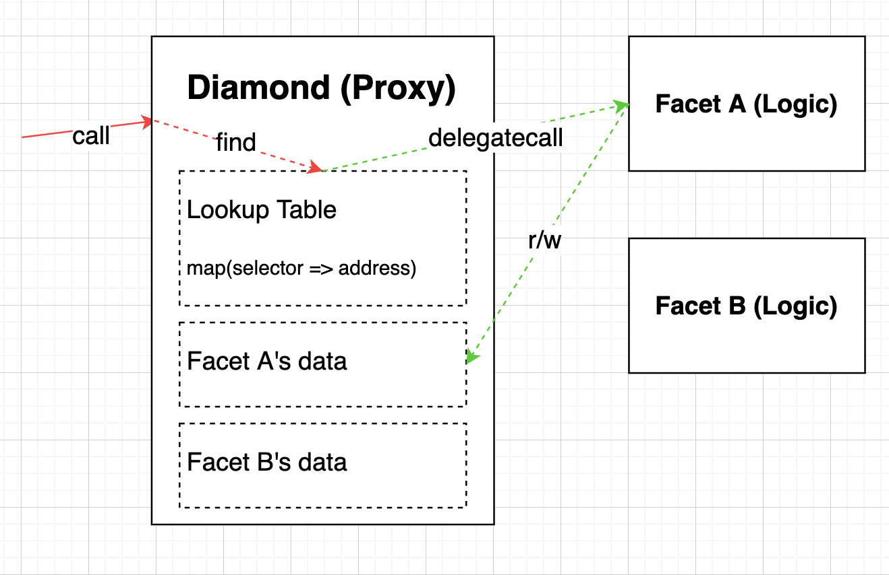

本文為 Diamond 101 系列的第二篇文章，將解釋這個 EIP 具體的實作細節。

<!--truncate-->

## Contract Architecture

首先來看一下使用 EIP-2535 的合約架構圖。EIP-2535 發明了很多術語，圖中 **Diamond** 就是 Proxy Contract，**Facet** 就是 Logic Contract。一有合約調用，則會先在 Lookup Table 查詢有沒有 selector 的資料，然後調用 delegatecall 過去，資料一樣寫在 Proxy 裡面。



## Lookup Table

Lookup Table 的資料結構可以以 `mapping` 或是 array 等來設計，作者以 `bytes4[]` 和 `mapping` 一起使用，主要是為了達成 Enumerable 的特性。另外為了避免 storage collision，也將 Lookup Table 放到特定的 storage 裡面。

**Lookup Table** 的資料結構和 storage slot
```js
bytes32 constant DIAMOND_STORAGE_POSITION = keccak256("diamond.standard.diamond.storage");

struct FacetAddressAndSelectorPosition {
    address facetAddress;
    uint16 selectorPosition;
}

struct DiamondStorage {
    // function selector => facet address and selector position in selectors array
    mapping(bytes4 => FacetAddressAndSelectorPosition) facetAddressAndSelectorPosition;
    bytes4[] selectors;
    mapping(bytes4 => bool) supportedInterfaces;
    // owner of the contract
    address contractOwner;
}
```

## Loupe

實作了 Lookup Table 查詢功能的 Facet 稱為 Loupe，主要功能為 Lookup Table 的查詢。為何 Lookup Table 的資料結構那麼複雜，看看這堆查詢函式能什麼資料就知道了。

```js
interface IDiamondLoupe {
    struct Facet {
        address facetAddress;
        bytes4[] functionSelectors;
    }

    function facets() external view returns (Facet[] memory facets_);

    function facetFunctionSelectors(address _facet) external view returns (bytes4[] memory facetFunctionSelectors_);

    function facetAddresses() external view returns (address[] memory facetAddresses_);

    function facetAddress(bytes4 _functionSelector) external view returns (address facetAddress_);
}
```

## diamondCut

`diamondCut` 則是一個函式，專門管理（新增、刪除、修正）Lookup Table。

```js
interface IDiamondCut {
    // Add = 0, Replace = 1, Remove = 2
    enum FacetCutAction {Add, Replace, Remove}

    struct FacetCut {
        address facetAddress;
        FacetCutAction action;
        bytes4[] functionSelectors;
    }

    function diamondCut(
        FacetCut[] calldata _diamondCut,
        address _init,
        bytes calldata _calldata
    ) external;

    event DiamondCut(FacetCut[] _diamondCut, address _init, bytes _calldata);
}
```

## Glossary

列出 EIP2535 發明的術語

- **diamond**: Proxy Contract
- **facet**: Logic Contract
- **loupe**: 一個實作 Diamond 查詢介面的 Facet
- **diamondCut**: 一個特定的函式名稱，專門用來管理（新增、刪除、修正）Lookup Table
- **Upgradeable Diamond**: 有註冊 `diamondCut` 的 Diamond Contract，可以註冊新的函式到 Lookup Table 裡做升級
- **Finished Diamond**: 一個 Upgradeable Diamond，歷經升級迭代後功能都完全了，最後將 `diamondCut` 移除 Lookup Table
- **Single Cut Diamond**: 只在 constructor 註冊 function 進註冊表，部署完成後就不能做任何升級
