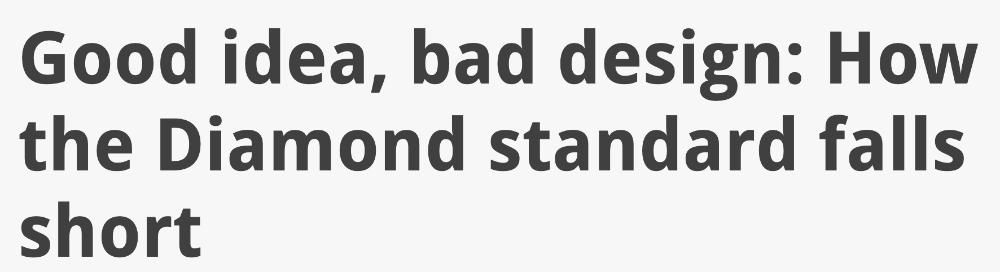
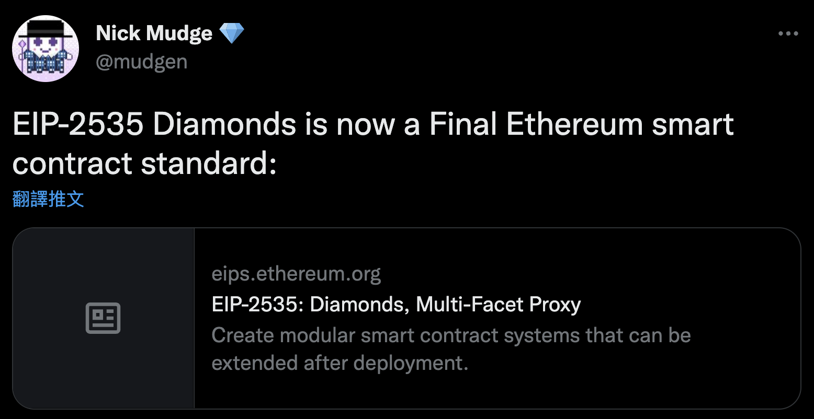

本文為 Diamond 101 系列的第四篇文章，來討論這個 EIP 著名反方的意見。

<!--truncate-->

在 2020 十月的時候，一間著名的審計公司寫了一篇非常知名的文章，這篇文章直到現在都還會被拿來認為是 Diamond 的反面教材。標題非常聳動，直接說明 Diamond 是個 bad design。以下來看看 Trait of Bits 找到了什麼。



## a. Over-engineered code

### IDiamondCut

看看原本 EIP 相關的實作，`diamondCut` 是 diamond 唯一的升級函式，但是這個函式設計的非常複雜。Diamond 是一個 Lookup Table 記錄 function selector 對應的地址，升級還分成 Add/Remove/Replace 三種，各自還有不同的檢查，一般的升級合約只分成 Set/Unset 兩種。這增加了很多升級複雜度。

不過在詢問過作者為何不是 Set/Unset 之後，作者給我的理由我也可以理解。`diamondCut` 會在一筆 transaction 裡面更新許多的地址，針對不同的行爲做檢查避免前後的修改發生錯誤。

### IDiamondLoupe

這部分的程式碼複雜則是因為真的「over-engineered」，連帶造成資料欄位設計複雜。

Lookup Table 設計上極為簡單，`mapping(bytes4 => address)` 這樣就好了。頂多也只有 `IDiamondCut` 在升級過程需要做不少處理。

再來看看 `IDiamondLoupe` 提供什麼樣的 view function，一共四個：
- `facets`: 提供所有註冊在 Lookup Table 的 logic contract 的地址和所有註冊過的 function selector
- `facetFunctionSelectors`: 提供一個 logic contract 所有註冊過的 function selector
- `facetAddresses`: 提供所有註冊在 Lookup Table 的 logic contract 的地址
- `facetAddress`: 尋找 selector 是哪個 logic contract 所提供的

```solidity
interface IDiamondLoupe {
  struct Facet {
    address facetAddress;
    bytes4[] functionSelectors;
  }

  function facets() external view returns (Facet[] memory facets_);

  function facetFunctionSelectors(address _facet) external view returns (bytes4[] memory facetFunctionSelectors_);

  function facetAddresses() external view returns (address[] memory facetAddresses_);

  function facetAddress(bytes4 _functionSelector) external view returns (address facetAddress_);
}
```

這四個函式造成 Lookup Table 需要額外記錄所有的 function selector，所以 storage 長成了這副模樣。這是個 Enumerable Set，一半的 view function 需要將整個 Set 掃過一次，這應該我頭一個看到「為了查詢使得複雜度變高的設計」。

```solidity
struct FacetAddressAndSelectorPosition {
  address facetAddress;
  uint16 selectorPosition;
}

struct DiamondStorage {
  mapping(bytes4 => FacetAddressAndSelectorPosition) facetAddressAndSelectorPosition;
  bytes4[] selectors;
}
```

## b. Storage pointer risks

這是所有使用 unstructured storage 作為管理 storage 的通病。unstructured storage 是將資料儲存到特定 slot 的 storage 管理方式，但是這樣的手法不會輸出成 storage layout 的檔案，所以也沒辦法用 slither 等工具分析。

```solidity
assembly {
  ds.slot := PTR
}
```

## c. Function shadowing

Function shadowing 是指 Proxy 上有實作一些 external function，所以同樣 function selector 的函式不會被 delegatecall 到 logic contract 執行，而是在 proxy 上被執行。但是我在現在的 repo 沒有看到這類問題。

## d. No contract existence check

Diamond 是在升級過程中檢查，只有合法地址才可以寫入 lookup table，但是 Trait of Bits 只看到 fallback function 沒檢查。

# Conclusion

總結來說，Trait of Bits 檢查到的 security issue 很多都是不存在的，除了 over-engineered 還有變高的 gas cost 之外，Lookup Table 加上 unstructured storage 的確可以做到只升級單一個函式，而且升級可以有更多的彈性，不過也需要開發者熟悉更多的知識和管理多個 logic contract 所產生的問題。

題外話，這個 EIP 今年終於 Final 了，Openzeppelin 也打算要支援 EIP-2535，需要來寫一篇來為這系列收尾 XDD



# Reference

- [Good idea, bad design: How the Diamond standard falls short](https://blog.trailofbits.com/2020/10/30/good-idea-bad-design-how-the-diamond-standard-falls-short/)

