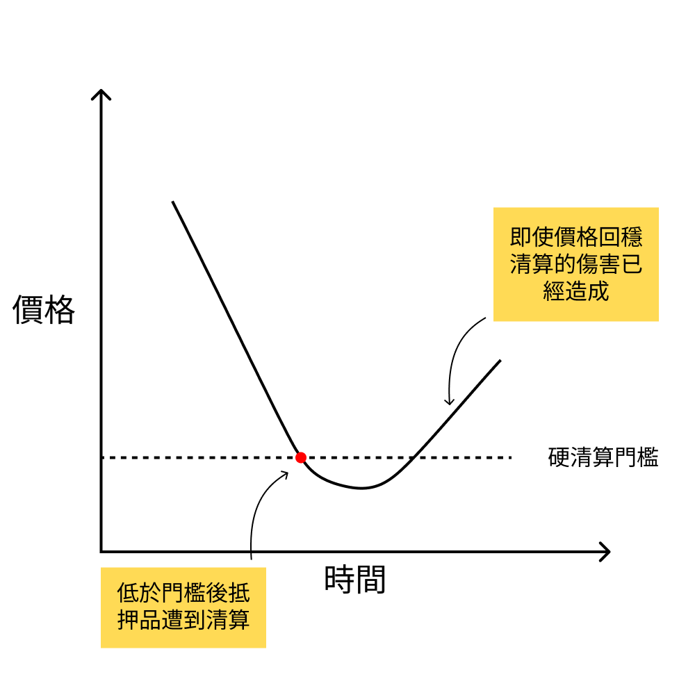

2022 年底 FTX 大爆炸的同時，Curve 團隊釋出了最新的 crvUSD 穩定幣設計白皮書。在這份白皮書裡面提出了新的穩定幣清算機制 LLAMMA (Lending-Liquidating AMM Algorithm)，而這樣的清算機制其實不只可以用在穩定幣上面，其他有清算需求的專案也都可以參考這樣的設計。除了清算機制以外，白皮書內也提及了如何跟美金錨定的穩定機制與合約 PegKeeper。

本篇文章會著重解釋 LLAMMA 的機制，並且透過 curve-stablecoin 裡面的源碼以及測試案例來解釋 crvUSD 清算機制，並且概略的提到 crvUSD 的穩定機制。

<!--truncate-->

## 前情提要
在進入正題前，我們會先解釋一些相關的概念來幫助讀者進入主題，以下會先解釋抵押品穩定幣、DAI 的清算方式以及傳統 AMM 的運作方式。

### 抵押品穩定幣
首先 crvUSD 是一個抵押品穩定幣，這也代表所鑄造出來的 crvUSD 背後都有超過發行額度的抵押品來支撐價值，同時在抵押品價格下跌時會觸發清算程序來確保穩定幣背後都有足夠的價值支撐，最著名的抵押品穩定幣為 MakerDAO 的 DAI。

相對於抵押品穩定幣的是算法穩定幣，透過演算法而非抵押品來保證穩定幣與美金的錨定，這類穩定幣近期最著名的是 Terra 的 UST。

### DAI 的清算方式
DAI 是透過超額抵押的方式提供穩定幣價值支撐的抵押品穩定幣。比如說當使用者抵押 3500 等值美金的 ETH 時，可以鑄造出 2000 美金等值的 DAI。但如果 ETH 價格下跌到一定程度時，使用者的抵押品就會被標記成可清算。

這個清算過程中，抵押品如 ETH 會用折扣的方式出售，所有人都可以來參與折扣的抵押品競標。比如說在 ETH 價格為 2900 美金時，系統會以 2800 美金的價格出售，這就會吸引套利者前來競標。

當清算結束後，如果抵押品拍賣的價格比較好，其中一部分的抵押品可能就不會被清算掉，此時就會還給債務人。但是大部分的抵押品通常都會被清算導致損失慘重，即使價格回穩，但清算已經造成傷害。



接下來會講解傳統的 AMM 運作方式作為 LLAMMA 的特殊設計 AMM 的對照參考。

### 傳統 AMM 的運作方式
以 Uniswap V3 為例，使用者可以透過 Range Order 的方式來提供流動性。比如說當 ETH 為 3000 USD 時，使用者可以把 1 ETH + 0 USD 放入 Uniswap V3 裡面，並且指定在 3200 - 3800 USD 的區間換成 USD。


當 ETH 進入上述區間之後，1 ETH 就會慢慢的被換成 USD，當超過 3800 USD 時，所有的 ETH 都會被換成 USD，這個效果很像在中心化交易所當中從 3200 一路掛限價單 (Limit Order) 到 3800 USD 的效果。

但跟限價單不同的是如果此時價格又跌回 3000 後，在 Uniswap v3 上面所有的 USD 又會被換回 ETH。

反方向來說，使用者也可以提供比如 3000 USD + 0 ETH，並且指定佈署在 2000 - 2500 USD 的區間，當價格下跌時，USD 就會逐漸的被換成 ETH，直到低於 2000 USD 時，所有的 USD 都會被換成 ETH。

## LLAMMA
crvUSD 跟 DAI 一樣也是抵押品穩定幣，但其中的清算機制採用了 LLAMMA 這種新設計的清算機制，結合了 AMM 的特性在價格下跌時抵押品會逐漸轉移成穩定幣，讓原本要清償的債務有一定程度的穩定幣可以償還，同時在價格回穩時再逐漸把穩定幣換回抵押品，而不是硬生生的觸發清算導致債務人的虧損。

鑄造 crvUSD 的時候同樣的會需要存入抵押品如 ETH 到智能合約來，不一樣的是這個抵押品會被放入一個 LLAMMA 特殊設計的 AMM 當中。跟 Uniswap 的 Range Order 一樣，剛存入抵押品到 AMM 時會以單邊的形式存在，而當抵押品價格下跌到一定程度時，就會逐漸換成穩定幣。

舉例來說當 ETH 價格為 3000 美金的時候，使用者可以抵押 1 ETH 到系統的智能合約裡面。此時系統會鑄造出 crvUSD 給使用者，同時抵押的 1 ETH 會被類似 Uniswap v3 的方式被放入一個特殊的 AMM 裡面，比如說流動性會被放在 500-550 USD 這個區間當中，而所取得的 LP 代幣則會只有單邊的 1 ETH + 0 crvUSD 流動性。


當 ETH 價格跌到 550 USD 以下時，系統會開始慢慢的把 ETH 換成 crvUSD，當跌到 550 USD 以下時，所有的流動性就會變成 crvUSD。當價格跌到這個區間時，系統將會用比市場上更便宜的價格售出 ETH，此時就會吸引市場上的人來到這個特殊的 AMM 裡面來買 ETH 來獲得折扣價。

因為系統會逐漸的把抵押品 ETH 換成穩定幣 crvUSD，所以就不會像 DAI 一樣到硬清算門檻後就直接把所有抵押品都清算掉。更進一步的是當抵押品 ETH 的價格如果回穩後，使用者的流動性又會逐漸的從穩定幣 crvUSD 換成 ETH，就像什麼事情都沒發生一樣。而且還可以從這個代幣交易的過程當中收取到手續費。


這邊有三件事情要特別注意：
1. LLAMMA 跟傳統 AMM 的方向相反：傳統 AMM 放入單邊資產之後，要價格提升才可以換成另外一邊，而 LLAMMA 的特殊 AMM 則是價格下跌之後才會換成另外一個資產（穩定幣）
2. LLAMMA 需要依賴外部的預言機 (Oracle) 價格：因為 LLAMMA 需要賣的比外面的更便宜，所以會需引入預言機價格，才可以知道有流動性的時候要如何折扣定價來吸引套利者
3. crvUSD 還是有清算機制：雖然可以透過 LLAMMA 的特殊 AMM 逐漸轉換成穩定幣，但是如果債務健康狀況太糟糕，還是會有最後的清算機制

## 透過測試案例解釋實際運作方式
crvUSD 除了白皮書以外也釋出了[源碼](https://github.com/curvefi/curve-stablecoin)，其中的測試案例 [test_create_loan](https://github.com/curvefi/curve-stablecoin/blob/2a35957b578b8c74a9b7140b33960d58cb9e3ec4/tests/lendborrow/test_create_repay.py#L9) 正好覆蓋了整個借款過程，這邊利用這個測試案例來解釋整個流程會更容易理解。

為了得到更多資訊，我 fork 了原本的源碼並且在目標的測試案例裡面印出了更多資訊（不太熟悉 Vyper 環境，只能用比較土砲的作法），有興趣的可以參考下面的 commit 了解我做了什麼修改：

https://github.com/yurenju/curve-stablecoin/commit/c3bf52353f41914deb82f1c1c97dcbc5de2d72e4

首先要先解釋一下波段 (band)。

### 波段 (band)
波段是當使用者把抵押品存入系統時，抵押品會被存入的區段，當預言機價格移動到這個區間時，使用者的抵押品就會開始被轉換成穩定幣。而剛開始建立 AMM 時會根據預言機的價格切分波段，其中預言機價格所在的波段會是波段 0 (band 0)，預言機價格越低，波段編號越高。


比如說創建 AMM 的時候預言機報價 3000 USD，此時波段 0 的價格帶會是 2970 - 3000，而波段 1 的價格帶是 2970.0 - 2940.3。而由於目前價格落在波段 0，所以 `AMM.active_band()` 就會回傳 0。

至於每個區間的價格寬度則由 AMM 建構子所傳入的 A (Amplification) 決定，公式為：

$$
\frac{p_{\downarrow}}{p_{\uparrow}}=\frac{A-1}{A}
$$

舉例來說，當價格上界 $p_\uparrow$ 為 3000 而 A 為 100 時，價格下界 $p_\downarrow$ 則為：

$$
\begin{aligned}
p_{\downarrow} &=\frac{p_{\uparrow}(A-1)}{A} =\frac{3000(100-1)}{100} = 2970
\end{aligned}
$$

每個波段的價格下界正好會接著上個波段的價格上界形成一個連續的流動性區間，如果想知道該波段所代表的預言機價格上下界，可以用以下兩個函式查詢： 
- `AMM.p_oracle_up(band_number)`
- `AMM.p_oracle_down(band_number)`

當每次有人借出 crvUSD 或是有人跟 AMM 交易時，系統會根據當下的外部預言機價格與目前的流動性交易情形來更新現行的區段 `amm.active_band`。

而在 `active_band` 裡面的流動性則會開始被交易，也就是抵押品可以被交易成為穩定幣，反之亦然。當 `active_band` 的流動性被交易殆盡後，會跳到下一個波段繼續交易，並且更新 `active_band` 到下一個波段。

### 存入抵押品來鑄造 crvUSD
根據測試案例 [test_create_loan](https://github.com/curvefi/curve-stablecoin/blob/2a35957b578b8c74a9b7140b33960d58cb9e3ec4/tests/lendborrow/test_create_repay.py#L9) 的前置條件如下：
- 抵押品為 WETH，目前[價格為 3000 USD](https://github.com/curvefi/curve-stablecoin/blob/2a35957b578b8c74a9b7140b33960d58cb9e3ec4/tests/conftest.py#L9)
- 穩定幣為 crvUSD

使用者呼叫 `Controller.create_loan(collateral, debt, number_of_bands)` 來鑄造穩定幣，存入了 [1000 WETH](https://github.com/curvefi/curve-stablecoin/blob/2a35957b578b8c74a9b7140b33960d58cb9e3ec4/tests/lendborrow/test_create_repay.py#L15)，欲[鑄造或是說借出 500,000 crvUSD](https://github.com/curvefi/curve-stablecoin/blob/2a35957b578b8c74a9b7140b33960d58cb9e3ec4/tests/lendborrow/test_create_repay.py#L17)，並且將流動性佈署在 5 個波段內：

```python
market_controller.create_loan(1000 ETH, 500000 crvUSD, 5)
```

此時系統會根據抵押品數量、欲鑄造的穩定幣數量決定要把流動性放在哪五個波段內。要決定是哪五個波段，可以透過 `Controller.calculate_debt_n1(collateral, debt, bands)` 來得到上界的波段，再加上波段總數 5 就可以取得下界。

以這個例子而言，`calculate_debt_n1(1000 WETH, 500000 crvUSD, 5)` 所回傳的上界 n1 為 `170`，總共放在五個波段內，所以下界就是 `174`。

若想查詢這個連續波段的上下界的預言機價格，可以用 `AMM.p_oracle_up(170)` 跟 `AMM.p_oracle_down(174)` 取得。這個連續的波段價格上界為 543.38，下界則為 516.75。這也代表當外部的預言機價格降到這個區間時，使用者存入的抵押品會在 AMM 裡面被以比預言機報價更便宜的價格賣出，讓套利者會想要到系統內買到更便宜的抵押品獲利。

存入的抵押品將會平均的佈署在這五個波段上，也可以透過 `AMM.bands_y(band_number)` 來取得特定波段的抵押品數量，比如說 `bands_y(170)` 會得到該波段總共有 200 WETH 的抵押品，查詢 170 - 174 都會是 200 WETH。

### 跟 LLAMMAS 交易折扣的 WETH 抵押品
curve-stablecoin 提供了許多方便的工具可以使用，如測試用的預言機讓我們可以直接修改預言機價格進行測試。

我們可以透過 `price_oracle.set_price(p)` 來改變預言機價格。這邊我們用 `set_price(540)` 把價格從 3000 改成 540，這也是波段 170 的範圍。使用 `p_oracle_up(170)` 與 `p_oracle_down(170)` 可以得知波段 170 的範圍約是  543.38 - 537.95。

此時呼叫 `AMM.exchange(0, 1, in_amount, 0)` 可以用 crvUSD 交換 WETH 資產。若使用 100 crvUSD 可以交換到約 0.185634 WETH，平均價格為 538.69 crvUSD，相較起來會比起預言機價格的 540 USD 更為便宜。

假設上面這個交易沒有進行，但是預言機價格調到 535 USD，也就是調整到波段 171 時，此時再進行同樣的交易用 100 crvUSD 交易 WETH，則平均價格則為 523.87 crvUSD，這也說明了預言機價格也會影響 AMM 的內部價格，當預言機價格變低時，AMM 拋售抵押品的價格也會進一步的降低，讓套利者願意到系統裡面來套利，進一步的協助債務人的債務有更多穩定幣支撐。

## crvUSD 的穩定機制 PegKeeper
crvUSD 除了透過 LLAMMA 來執行轉換與清算外，還有另外一個模組 PegKeeper 合約進行穩定幣的錨定功能。

這邊會使用到一個 Curve 一般的 AMM 穩定幣交易池 StableSwap，裡面的代幣對是 crvUSD 以及另外一個 LP 代幣如 3Crv 進而組合成的 MetaPool。

當 crvUSD 的價格高於 1 USD 時（比如說 crvUSD 的使用需求增加），PegKeeper 會鑄造出無抵押的 crvUSD 並且注入這個 StableSwap。此時套利者發現市場上的 crvUSD 價格高於 1 USD，但是這個 StableSwap 價格卻接近 1 USD 時就會到 StableSwap Pool 來套利，進而讓市場上的 crvUSD 價格下跌靠近 1 USD。

當 crvUSD 價格低於 1 USD 時，反過來 PegKeeper 可以從 StableSwap 抽出資金並且銷毀，並且讓套利者進來重新平衡價格，讓市場上的 crvUSD 上漲靠近 1 USD。

這個 PegKeeper 合約雖然可以鑄造與銷毀 crvUSD，但它在智能合約的邏輯限制只能夠針對特定的 StableSwap 池子注入與抽出 crvUSD  來限制用途。

## 結論與疑問
本篇文章解釋了 crvUSD 所提出的新清算方式 LLAMMA 透過 AMM 的特性進行針對債務人更友善的清算/轉換方式，並且透過測試案例來一窺 crvUSD 實際運作的方式，並且概略的解釋了 PegKeeper 透過 Curve MetaPool 來進行的穩定機制。

LLAMMA 是個新的概念，套用了 AMM 的 range order 特性到清算機制來，確實對於債務人更有友善，當價格回穩的時候損失的程度大幅降低，甚至有可能透過交易費獲利。但是由於折價的關係，可以預期價格回穩時，內部的 AMM 要追上外部的價格會多花一點時間（因為他的價格比外面差）。但是相較於傳統的清算方式損失還是會減輕很多。

LLAMMA 確實是一個可以進一步研究的新清算方法，而且不一定是穩定幣，有需要清算的場合如 Perpetual Protocol 衍生性商品市場也可以考慮用同樣的清算方式來減低清算抵押品帶來的損失。

至於 PegKeeper 透過 Curve MetaPool 所進行的穩定掛勾方式，我則比較存疑。如果說 DAI 是透過升息、降息的方式調整市場熱度，PegKeeper 則是更為激進直接透過類似量化寬鬆/緊縮的方式印出鈔票投到所需的市場。當然透過智能合約的限制還是會比起量化寬鬆更為透明，但是還需要進一步深究是否有影響市場經濟所帶來的副作用。

另外一方面在這個穩定錨定用的 MetaPool 當中新鑄造的 crvUSD 是無抵押生成的，或者是說是以另外一側的 LP 代幣如 3crv 作為抵押生成，而透過套利者的搬運來讓 crvUSD 重新錨定到 1 美金，實際上會損害流動性提供者的利益。因為套利者透過價差套利時，流動性提供者就作為他的對家承受損失。

這方面還不知道交易費是否足以覆蓋價差的損失，可能還需要進一步的機制去補償流動性提供者才可以完成整個穩定機制。如果沒有獎勵機制，要如何鼓勵使用者來為 crvUSD 提供穩定機制？這也是目前白皮書並沒有涵蓋到的概念。

但 crvUSD 目前也還沒有上線，相信未來這些疑問還可以進一步的被回答或是改善，也期待他們正式上線來驗證他們的想法。

最後如果你對本文有任何的問題，歡迎到 [討論區](https://github.com/lun-dao/LunDAO/discussions/100) 提出！