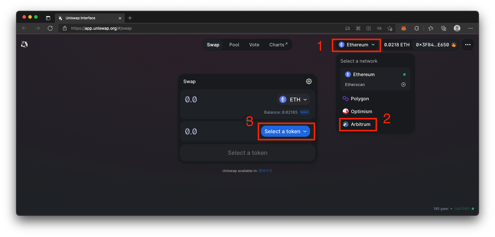
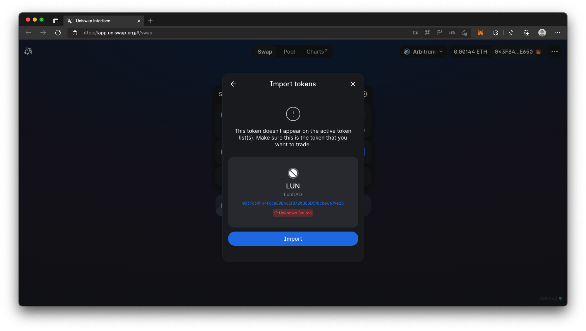
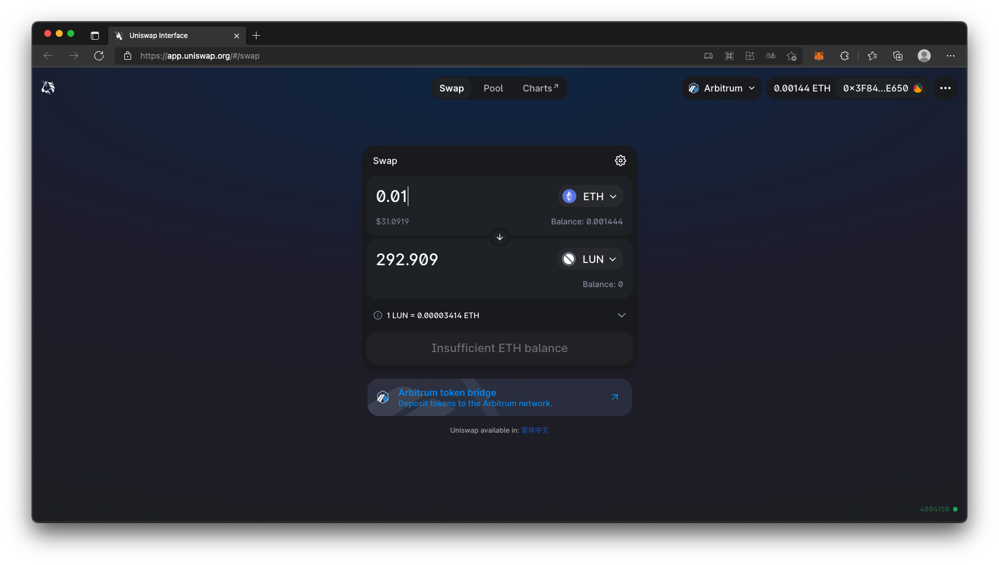

# LUN 代幣
LUN 代幣是由 LunDAO 所發行的社群代幣，此代幣主要有幾個用途：
1. [社群治理][1]：透過 snapshot 決定社群事務
2. [Request For Article 懸賞][2]：如有特定主題希望有人撰寫時，可以透過 RFA 進行文章懸賞
3. [文章獎勵][3]: 在 LunDAO 發表文章可以收到以 LUN 發送的文章獎勵
4. [社群組織獎勵][6]: 協助組織社群事務可以獲得以 LUN 發送的社群組織獎勵

## 合約地址
- Ethereum mainnet: [0xd6b5f077c56e94de018e34d4908f36848b2c9d3f][4]
- Arbitrum: [0x3Fc39F44FdcaE9E46Ef8720BE5D5f8cbeC619e25][5]

## 從 Uniswap 獲得代幣
除了透過參與 LunDAO 社群事務以及發表文章獲得 LUN 代幣外，當 Uniswap 上面有流動性時也可以在上面取得。首先到 [Uniswap][7] 上，並且選擇 Arbitrum 網路，透過 MetaMask 切換網路後，按下 Select a token。

接下來把 LUN 代幣在 Arbitrum 的地址填入後，下方會出現 Import 可以匯入 LUN 到代幣清單中的按鈕。

點選 Import 後則會出現警告說明此代幣並沒有在任何代幣清單內，請在此檢查 LUN 代幣的合約地址，是否與本文上面的合約地址相符。

再次按下 Import 後就可以用其他代幣交換 LUN 了。

[1]: https://snapshot.org/#/lundao.eth
[2]: request-for-article
[3]: publish-reward
[4]: https://etherscan.io/address/0xd6b5f077c56e94de018e34d4908f36848b2c9d3f
[5]: https://arbiscan.io/address/0x3Fc39F44FdcaE9E46Ef8720BE5D5f8cbeC619e25
[6]: organization-reward
[7]: https://app.uniswap.org/#/swap
