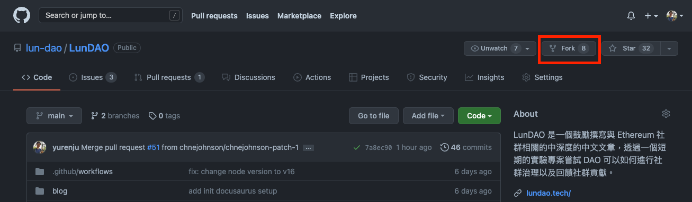

LunDAO 是一個由社群貢獻的 Ethereum 中文文章發表平台。我們希望可以讓 Ethereum 社群可以有更多的中文資源來協助使用者們更好地瞭解相關技術。為了鼓勵文章發表，LunDAO 設置了發表文章的獎勵，請到 [文章獎勵][1] 了解詳情。

在 LunDAO 發表文章分成幾個幾個階段：
1. 找到適合發表的文章
2. 文章授權
3. 發布草稿
4. 文稿審閱
5. 發布與獎勵

# 找到適合發表的文章
若你已經有明確的主題想撰寫，但不知道是否適合在 LunDAO 上面發表，你可以簡單地問自己：「這篇文章是否可以讓大眾更瞭解 Ethereum 相關知識？」，不管讀者是剛接觸的新手或是想要了解深度的特定知識的老手，如果答案是肯定的，代表這篇文章適合在 LunDAO 發表。

如果你還不是很確定，可以直接在 [Github Discussion][2] 或是 [Discord][3] 上面詢問社群成員特定主題是否適合。

另外一個方式是可以到 [Github Issue][6] 裡面找標籤為 `Request For Article` 的 issue，這代表其他人希望看到這樣主題的文章，但卻還沒有類似的文章，通常這樣的文章內容會帶有獎勵，詳情請見 [文章獎勵][1]。

# 文章授權
除了撰寫文章外，還有一件很重要的事情：授權。在 LunDAO 所發表的所有文章都會採用 Creative Common 的 [CC-BY-SA][4] 發表，這代表其他人如果以相同授權 CC-BY-SA 在其他轉載或修改你的文章變成另外一篇文章時，只要他明確標明出處與作者，這樣的利用方式是允許的。

這是為了讓知識可以分享給更多人，但同時也要清楚標明原作者的貢獻所採用的授權方式。若你要在 LunDAO 進行寫作，請記住所有文章都會採用這個授權形式。

# 撰寫與發布草稿
在 LunDAO 所有文章都採用 Markdown 格式來撰寫文章，請先按右上角的 Fork 按鈕，分岔一份 LunDAO 專案到你的帳號。



分岔後會在你自己的帳號建立一份完整的 LunDAO，你可以用 git clone 指令將整個 LunDAO 複製到你的電腦：

```shell
$ git clone git@github.com:<YOUR_ACCOUNT>/LunDAO.git
```

接下來會需要建立一個新的分支 (branch)。一般分支的命名會用斜線分類、小寫英文加上連字號作為名字，比如說你想寫一篇 DAO 的介紹，分支名字可能會是 `article/dao-introduction`。你可以以下指令建立分支：

```shell
$ git checkout -b article/dao-introduction
```

完成後你就可以打開你慣用的編輯器開始在 blog 目錄底下建立一個 Markdown 檔案來新增你的文章，延續前面的例子，你可以新增 `blog/dao-introduction.md` 開始寫作。如果你需要任何額外的圖檔，可以放到 `blog/assets/` 裡面，如果目錄還不存在，請建立一個。

關於如何撰寫文章的細節，請見 [docusaurus 的 blog 文件][5]。

撰寫完畢後，請你發一個 Pull Request 並且依據樣板填寫相關資訊。發出 Pull Request 之後，這樣草稿就發布了。建議你也在 Discord 跟大家說一聲你發表了什麼文章的草稿，吸引更多成員來協助審稿。

# 文稿審閱
在 LunDAO，每篇文章至少要經過一個社群成員的審閱。文稿審閱會基於 Pull Request 提供的資訊進行審閱，這個階段會需要跟作者來回討論文稿。

# 發布與獎勵
當至少有一個社群成員審閱文稿後，你可以用 @ mention 管理員如 yurenju#7837 或 hydai#7494 請他們協助合併你的文章。當合併完成後數分鐘，本篇文章就會發布了，恭喜！

關於文章發布的獎勵，請見 [文章獎勵][1] 一文了解更多。


[1]: publish-reward
[2]: https://github.com/lun-dao/LunDAO/discussions
[3]: https://discord.gg/9s3RQmajBu
[4]: https://creativecommons.org/licenses/by-sa/4.0/deed.zh_TW
[5]: https://docusaurus.io/docs/blog
[6]: https://github.com/lun-dao/LunDAO/issues?q=is%3Aissue+is%3Aopen+label%3A%22Request+For+Article%22
