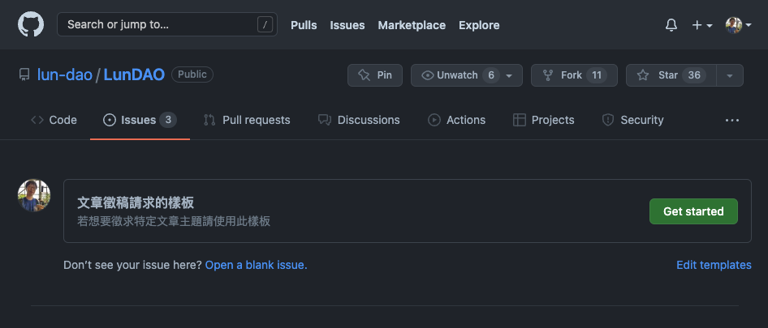

文章徵稿請求 (Request For Article, RFA) 是一種可以針對特定文章類型提出請求的方式。

區塊鏈與 Ethereum 是一個變化速度非常迅速的技術，有相當廣泛且完全不同面向的題材如去中心化治理機制設計、區塊鏈設計、DeFi 等等，同時每個主題也都會有需要探討到非常深入的內容，如擴容方案的零知識證明。而往往中文文章在這樣廣闊的茫茫主題中總是有許多主題資源匱乏。

當你希望看到特定主題時，可以透過 RFA 的方式徵求特定文章主題。

# 流程

我們未來會撰寫智能合約來處理 RFA 事務，在此之前則先用較為手動的方式處理。首先請到 [GitHub issues][1] 裡面點選 New Issue -> 文章徵稿請求的樣板。

填妥樣板內需的資訊之後就好囉！

每個 RFA 的 issue 都會有 issue 標籤表示以下不同狀態：
- RFA:new - 表示這個請求已經建立，還沒有任何人準備撰寫該主題
- RFA:took - 已經有人表示想要撰寫該主題
- RFA:approved - 此請求已經與請求者協調後給予一個評分

當有作者撰寫相對應於 RFA 的主題草稿後，請求者可以積極的參與審核，一起跟作者完善所發表的文章內容。當文章完成後管理者會再與發出請求的人確認此文章是否有滿足原本的徵求條件，並且協調應該撥款的比例給作者。比如說請求者收到了一篇「DAO 介紹」的文章，覺得這篇非常符合原本預計的需求，則可以 100% 撥款。若仍有不盡完善的部分，也可以協調給予部分撥款。可以參考以下評分機制：
- 100%: 這篇完全符合需求
- 80%：有部分不盡完善之處
- 60%：有不少需要完善之處
- 0%：這篇完全不符合需求

RFA 的獎勵會跟其他的 [文章獎勵][3] 一起定期發送。

# 未來
未來我們預計會透過智能合約來完善這個過程，最後決定的過程可以是請求者可以跟 LUN 代幣持有者一同決定文章有沒有符合需求以及撥款比例。我們可以藉由目前的手動方案觀察未來的機制要怎麼設計。

[1]: https://github.com/lun-dao/LunDAO/issues/
[3]: publish-reward